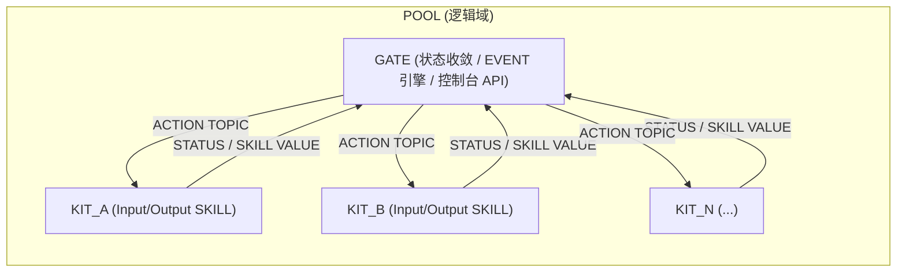

<div align="center">

# ZeroCloud · Alpha_260410

**面向线下沉浸式场景的 POOL / GATE / KIT 边缘自治系统**


</div>

---

> [!IMPORTANT]
> **Alpha_260410 已完成核心链路升级**：动态 SKILL 能力协议、离线/删除事件生命周期修复、危险重置独立页、代码 EVENT 本地编译测试、持久通知流、GATE↔KIT 名称同步、隐私参数清理（示例账号/密码占位化）。

## 项目概览

ZeroCloud 是一个把“感知-决策-执行”闭环尽量留在现场的边缘系统工程。它不依赖公网才能完成关键联动，也不要求每个终端都承载复杂逻辑，而是通过 **POOL（逻辑域）→ GATE（边缘脑）→ KIT（执行节点）** 的分层，让系统在复杂现场仍然保持可维护、可扩展、可快速恢复。  
在密室、展厅、文旅互动空间、舞台机关系统等“低容错 + 强实时 + 强空间交互”的业务中，云端往返延迟、网络抖动和链路不确定性会直接放大风险。ZeroCloud 的设计目标是：将关键状态、规则引擎和设备编排能力收敛到现场 GATE 层，降低不必要的外部依赖，把复杂性变为可观测、可治理的系统行为。

与传统“设备直接上云 + 云端统一编排”模式相比，ZeroCloud 在工程上更强调：  
1. **一致命名与一致语义**（协议、状态、生命周期统一）；  
2. **设备能力抽象**（SKILL 元数据自描述，前后端动态适配）；  
3. **事件安全生命周期**（离线锁死、删除死亡、防误触发）；  
4. **现场可运维性**（可视化控制台、可脚本恢复、可快速交付）；  
5. **开源可复用性**（GPLv3、结构清晰、文档完整、可二次开发）。

---

## 架构总览



---

## 核心能力矩阵

| 模块 | Alpha_260410 能力 | 工程价值 |
| --- | --- | --- |
| 设备发现与收编 | PENDING/PROVISION 零接触收编，UID 合并策略 | 新设备快速接入，老设备重连不乱套 |
| SKILL 能力协议 | `io/actions/action_specs/supports_duration` 结构化上报 | 前端表单与后端校验自动对齐 |
| EVENT 引擎 | 表单模式 + 代码模式 + 本地代码测试接口 | 从快速联动到复杂逻辑统一实现 |
| 生命周期治理 | 离线 `LOCKED`、删除 `DEAD`、危险动作隔离 | 避免误触发，提升现场安全性 |
| 控制台 UI | 磁贴式布局、持久通知流、危险页独立 | 实时可读、可追踪、可操作 |
| 名称同步 | GATE 改名广播，KIT 端显示实时同步 | 多设备现场统一认知，降低维护成本 |

---

## Alpha_260410 更新亮点

### 1) 事件状态一致性修复（核心）

- KIT 掉线后，关联 EVENT 会进入 `LOCKED`，并保持“不可启动，仅可编辑/删除”的状态语义。  
- KIT 被删除后，关联 EVENT 立即进入 `DEAD`，防止“幽灵触发”与失效目标执行。  
- 禁用事件不再被错误刷回 `IDLE`，生命周期状态在帧循环中被正确保留。

### 2) 动态 Output 技能能力模型

- Output 不再硬编码为 OLED。  
- KIT 可声明任意输出技能（例如喇叭、继电器、灯光、执行器），并附带 action 参数 schema。  
- GATE 前端根据 schema 自动渲染字段，后端按能力元数据进行严格校验，避免“前端能填、后端不认”的割裂。

### 3) 代码 EVENT 研发体验升级

- 提供代码骨架模板；  
- 提供 SKILL 方法查看工具（KIT/SKILL 选择后自动生成调用示例）；  
- 提供本地编译/运行校验接口（语法/加载/运行阶段结果）；  
- 一键提交编译 EVENT。

### 4) 配置与安全体验升级

- 首次组网改为 `POOL_` 与 `GATE_` 前缀 + 三位码输入规范；  
- 危险重置迁移到右上角独立入口和独立页面；  
- 发布版本删除隐私参数：示例代码中的 Wi-Fi/MQTT 私人参数已改为占位符。

---

## 项目结构（开源发布格式）

```text
ZeroCloud/
├── AUTHORS
├── LICENSE
├── NOTICE
├── README.md
├── VERSION
├── docs/
│   ├── ZeroCloud_Alpha_260409_Project_Manual.md
│   └── assets/
│       ├── images/
│       └── mermaid/
├── GATE/
│   ├── .env.example
│   ├── backend/
│   ├── frontend/
│   └── scripts/
└── KIT/
    └── ESP32-C6-Reference/
        ├── README.md
        ├── platformio.ini
        └── src/main.cpp
```

---

## 快速开始

### 1. 启动 GATE 后端

```bash
cd GATE
cp .env.example .env
./scripts/start-gate.sh
```

默认访问：`http://<GATE_IP>:8080`

### 2. 前端开发模式（可选）

```bash
cd GATE
./scripts/start-console.sh
```

### 3. KIT 编译与烧录

```bash
cd KIT/ESP32-C6-Reference
pio run
pio run -t upload
pio device monitor
```

> [!TIP]
> 烧录前请先编辑 `KIT/ESP32-C6-Reference/src/main.cpp` 中的 `WIFI_SSID` / `WIFI_PASS` / `BROKER_IP` 占位符。

---

## 图文速览

### 系统架构图


### EVENT 双模式引擎图


### Housekeeper 守护闭环


---

## 开发规范与开源治理

### 协议规范

1. Topic 语义采用五段式路径：`POOL/GATE/KIT/SKILL/ACTION`。  
2. SKILL 命名推荐统一前缀：`SKILL_`。  
3. KIT 能力声明推荐包含：`io/actions/action_specs/supports_duration`。  
4. EVENT 规则需可解释、可回滚，避免在现场直接写不可观测“黑盒逻辑”。

### 隐私与安全

- 示例仓库不得包含真实账号、密码、令牌、个人网络信息。  
- `.env.example` 仅允许占位符；生产密钥通过部署系统注入。  
- 危险操作（例如整机重置）必须两步确认并进入独立危险域 UI。

### 贡献建议

1. 先阅读 `docs/ZeroCloud_Alpha_260409_Project_Manual.md` 理解系统边界；  
2. GATE 变更建议同时更新前后端契约和 API 示例；  
3. KIT 变更建议同步更新能力协议与参考文档；  
4. 提交前保证文档、配置样例、版本号与代码行为一致。

---

## 路线图（Roadmap）

| 阶段 | 目标 | 说明 |
| --- | --- | --- |
| Alpha_260410（当前） | 单 GATE 稳定闭环 + 动态技能协议 | 完成生命周期一致性、动态表单、代码测试工具 |
| Beta | 多 GATE 协同与增量同步 | 增强跨 GATE 容灾、状态复制、策略分发 |
| RC | 安全与权限体系完善 | 更细粒度鉴权、审计日志、发布流程标准化 |

---

## 文档入口

- 项目总手册：`docs/ZeroCloud_Alpha_260409_Project_Manual.md`  
- 根目录镜像手册：`../ZeroCloud_Alpha_260409_Project_Manual.md`  
- GATE 文档：`GATE/README.md`  
- KIT 文档：`KIT/ESP32-C6-Reference/README.md`

---

## 许可证

本项目采用 **GPL-3.0-only** 协议。你可以在遵守 GPLv3 的前提下自由使用、修改与分发本项目代码，并保留原始版权与许可证声明。
