# ZeroCloud 边缘集群系统总手册（Alpha_260409 正式技术版）

<p align="center">
  <strong>POOL / GATE / KIT</strong><br/>
  面向沉浸式线下场景的边缘自治系统工程文档
</p>

<p align="center">
  
  
  
  
</p>

> **版本**：Alpha_260409  
> **作者**：Lei Wu  
> **许可证**：GPLv3  
> **文档路径**：`ZeroCloud_Alpha_260409/docs/ZeroCloud_Alpha_260409_Project_Manual.md`  
> **适用范围**：POOL / GATE / KIT 全栈架构、协议、实现、运维、质量、安全、交付、演进  
> **阅读建议**：先读第 0-3 章理解设计哲学，再按角色阅读后续章节（研发/运维/交付）。

---

## 文档导读

本文档以“可直接开源发布、可直接现场交付、可直接团队协作”为目标，强调以下原则：

1. **语义统一**：命名、协议、状态、错误都必须有一致语义。  
2. **边界清晰**：POOL/GATE/KIT 职责明确，避免跨层耦合。  
3. **可维护优先**：脚本、图表、示例、清单与代码同步演进。  
4. **故障可恢复**：每条关键路径都要有回滚与恢复策略。  
5. **演进可持续**：从 Alpha 到 Beta 的升级路径可拆解、可验证、可回退。

---

## 图册与源码索引（10 图）

> [!NOTE]
> 所有图片已重命名并归档在：`docs/assets/images/`  
> 对应 Mermaid 源码已归档在：`docs/assets/mermaid/`

| 序号 | 图名 | 图片 | Mermaid 源码 |
| --- | --- | --- | --- |
| 01 | ZeroCloud 系统总体架构 | `./assets/images/01-zerocloud-system-overview.png` | `./assets/mermaid/01-zerocloud-system-overview.mmd` |
| 02 | AE-Link 五段式协议主题树 | `./assets/images/02-ae-link-topic-tree.png` | `./assets/mermaid/02-ae-link-topic-tree.mmd` |
| 03 | KIT 零接触部署（ZTP）生命周期时序 | `./assets/images/03-kit-ztp-lifecycle.png` | `./assets/mermaid/03-kit-ztp-lifecycle.mmd` |
| 04 | SKILL 词典与硬件抽象层映射 | `./assets/images/04-skill-hal-mapping.png` | `./assets/mermaid/04-skill-hal-mapping.mmd` |
| 05 | POOL 治理模型与状态表结构 | `./assets/images/05-pool-governance-state-table.png` | `./assets/mermaid/05-pool-governance-state-table.mmd` |
| 06 | GATE 内部并发模块架构 | `./assets/images/06-gate-concurrency-architecture.png` | `./assets/mermaid/06-gate-concurrency-architecture.mmd` |
| 07 | EVENT 引擎双模式执行逻辑 | `./assets/images/07-event-dual-mode-engine.png` | `./assets/mermaid/07-event-dual-mode-engine.mmd` |
| 08 | 60Hz Frame Engine 判定循环帧 | `./assets/images/08-frame-engine-60hz-cycle.png` | `./assets/mermaid/08-frame-engine-60hz-cycle.mmd` |
| 09 | Housekeeper 守护机制与故障隔离闭环 | `./assets/images/09-housekeeper-fault-isolation.png` | `./assets/mermaid/09-housekeeper-fault-isolation.mmd` |
| 10 | Beta 演进：多 GATE 增量同步拓扑 | `./assets/images/10-beta-multi-gate-incremental-sync.png` | `./assets/mermaid/10-beta-multi-gate-incremental-sync.mmd` |

---

## 视觉总览（缩略索引）

### 图 01：ZeroCloud 系统总体架构

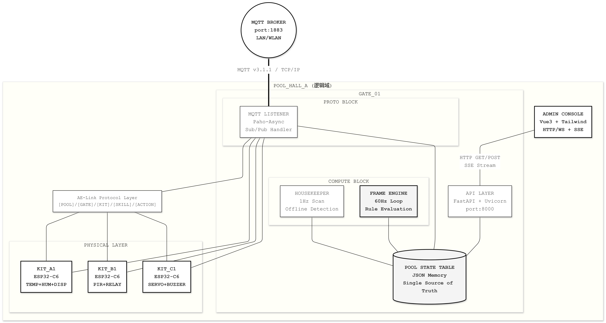

### 图 02：AE-Link 五段式协议主题树

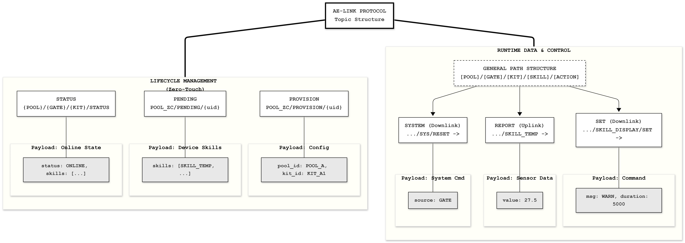

### 图 03：KIT 零接触部署（ZTP）生命周期时序


### 图 04：SKILL 词典与硬件抽象层映射

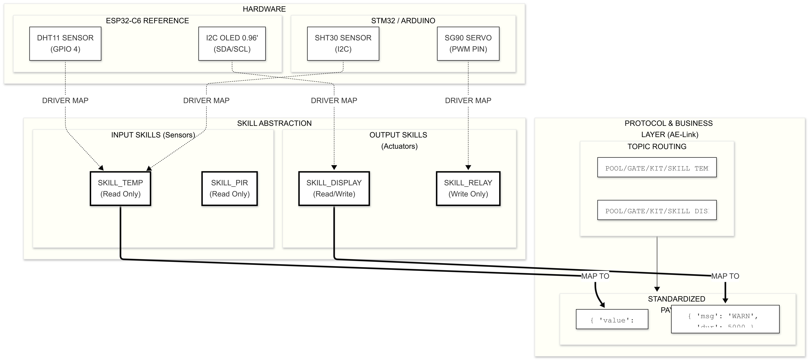

### 图 05：POOL 治理模型与状态表结构


### 图 06：GATE 内部并发模块架构


### 图 07：EVENT 引擎双模式执行逻辑


### 图 08：60Hz Frame Engine 判定循环帧

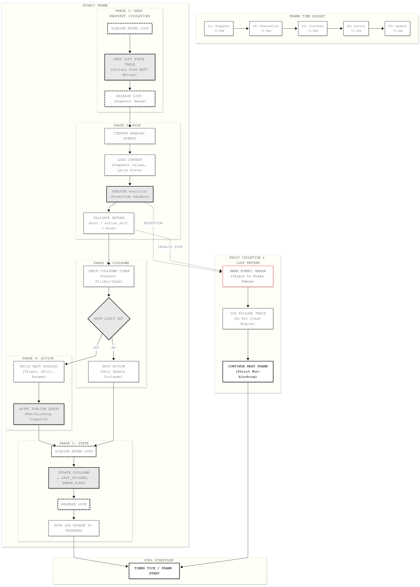

### 图 09：Housekeeper 守护机制与故障隔离闭环


### 图 10：Beta 演进：多 GATE 增量同步拓扑

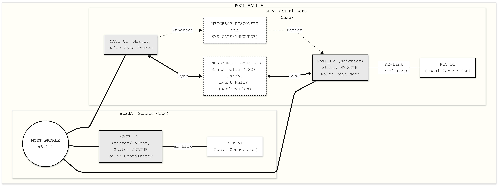

---

## 0. 引言：为什么是 ZeroCloud

ZeroCloud 的出发点不是“再做一个物联网平台”，而是解决线下沉浸式场景里最真实、最痛苦、最常见的工程问题：延迟不能高、隐私不能泄露、网络环境不可控、设备形态极度异构、部署现场的人力水平和可维护性普遍受限。传统的“终端上云、云端决策、终端执行”模式在消费级应用中可以成立，但在密室、展览、文旅综合体、主题民宿、数字演艺现场这类“低容错 + 强实时 + 强空间交互”的业务里，会迅速暴露出链路长、响应慢、依赖公网、调试困难、数据不闭环的问题。

ZeroCloud 的系统哲学是：**把“可感知、可决策、可执行”的闭环尽量留在现场，并将复杂性收敛到 GATE 层。** 这样可以让 KIT 保持轻量与稳定，让业务逻辑聚焦在边缘引擎，让部署和维护具备可复制性。换句话说，ZeroCloud 的目标不是把每块硬件都做成“小服务器”，而是让每个节点在自己的职责里做到“简单、清晰、可替换、可扩展”。

在工程实践层面，ZeroCloud 采用 POOL-GATE-KIT 三层模型：POOL 是逻辑域，GATE 是边缘脑干，KIT 是神经末梢。这个分层不是概念包装，而是为了明确地划分数据流、控制流、故障边界和运维边界。只要这条边界清晰，后续无论是设备替换、协议扩展、分布式演进、规则复杂化，系统都能在“不断演进”的同时保持“可理解、可维护、可定位问题”。

本手册将围绕这一核心目标，从概念定义、协议规范、后端架构、前端交互、KIT 参考实现、SKILL 模型、EVENT 引擎、部署运维、质量规范、开源发布规范等维度给出完整说明，并结合当前仓库中的 GATE 与 ESP32-C6 KIT 参考代码，形成 Alpha_260409 的标准化基线。

---

## 1. 系统总览：POOL / GATE / KIT 的职责边界

### 1.1 POOL：逻辑域，不是单机，不是云

POOL 是 ZeroCloud 中最核心的“逻辑空间单位”。它可以理解为一个业务域或一个现场域，例如一个展区、一个密室主题、一层酒店、一组联动装置。POOL 不是一台机器，也不是某个特定云服务，而是一个**资源命名与协同的范围边界**。所有参与该业务闭环的 GATE、KIT、SKILL 都属于某一个 POOL，并由这个 POOL 进行统一寻址与治理。

POOL 的价值体现在三个方面。第一，它统一了命名空间，设备联动不再依赖“某台机器上的临时配置”，而依赖结构化路径。第二，它让跨设备规则具备可移植性，规则可以围绕“POOL 内对象”编排，而不是围绕具体 IP 地址硬编码。第三，它提供了后续多 GATE 协同、增量同步、灾备切换的自然边界，为分布式演进预留空间。

### 1.2 GATE：边缘脑干，统一状态与规则

GATE 是 ZeroCloud 的执行中枢，承担状态收敛、规则计算、控制下发、配置管理、可视化运维等职责。GATE 不是“仅转发消息的中继”，而是具备业务语义的边缘控制器。它维护内存中的 POOL 状态表，维护 KIT 生命周期，维护 SKILL 能力清单，维护 EVENT 规则状态，并在固定帧率下做规则判定。

当前 Alpha_260409 版本中，GATE 采用 Python + FastAPI + MQTT + Vue 的实现方式，重点体现“可读、可改、可扩展”的工程平衡。其并发模型采用监听线程、帧频引擎、清道夫协程与 API 层解耦，目的是让 UI 响应、数据写入、规则计算、离线判定互不拖累。实践上，这比“一把锁 + 单循环”的快速脚本稳定得多，也比“过度微服务化”更适合现场部署。

### 1.3 KIT：无状态执行单元，能力即 SKILL

KIT 代表现场的感知与执行节点。它可以是 ESP32、STM32、Arduino，也可以是后续任意 MCU 或轻量边缘节点。ZeroCloud 不要求 KIT 承担复杂逻辑，反而强调 KIT 的**无状态倾向**：采集数据、接收控制、执行动作、上报状态、必要时持久化最小配置（例如被收编后的 POOL/GATE/KIT 标识）。

KIT 的价值在于“技能化抽象”。每种硬件能力通过 SKILL 命名暴露给系统，例如 `SKILL_TEMP`、`SKILL_HUM`、`SKILL_DISPLAY`。GATE 不关心你的底层是 DHT11 还是别的传感器，只关心你是否声明并上报了对应 SKILL。这样，硬件异构被协议同化，业务规则可以围绕 SKILL 编排而不是围绕具体芯片代码编排。

### 1.4 三层协同的工程收益

当 POOL、GATE、KIT 的边界被严格遵守后，系统会出现非常明显的工程收益：现场改线或替换设备时，规则层无需重写；前端显示可以根据自描述技能动态构建；设备离线与规则熔断有一致语义；新增 KIT 的接入流程可以标准化；多项目复制时可以把“最佳实践”变成模板而不是经验传递。这些收益在单场景里可能不明显，但当项目规模扩大、现场数量增加、团队协作增多时，会直接决定系统是否可持续维护。

---

## 2. AE-Link 协议与地址规范

### 2.1 五段式主题路径

ZeroCloud 的主题路径采用层级结构：

`[POOL_ID]/[GATE_ID]/[KIT_ID]/[SKILL_ID]/[ACTION]`

并允许在生命周期流程中使用简化路径（例如 `PENDING`、`PROVISION`）。这里最重要的是“语义稳定”：路径中每一段都有职责，不能在项目中随意复用含义。这样做虽然在前期看起来“比随手定义 topic 麻烦”，但在后期运维和跨团队协作时会显著降低理解成本。

### 2.2 生命周期主题（ZTP）

Alpha_260409 采用以下生命周期路径：

- 新设备请求收编：`POOL_ZC/PENDING/{uid}`
- 网关下发收编配置：`POOL_ZC/PROVISION/{uid}`
- 设备上线/离线状态：`{POOL}/{GATE}/{KIT}/STATUS`

特别注意：当前 ESP32 参考 KIT 在“未收编阶段”默认使用 `POOL_ZC` 的 PENDING/PROVISION 主题做引导通道。这是兼容现场部署的务实策略：先把设备收编进来，再通过配置载荷切换到目标 POOL/GATE/KIT 身份。GATE 侧必须兼容这种引导模式，否则会出现“设备发了 pending 但平台看不到”的典型故障。

### 2.3 设备能力与数据上报

KIT 上线后会通过 STATUS 载荷声明自身 SKILL 列表，随后按技能维度上报数据。例如温度上报至：

`{POOL}/{GATE}/{KIT}/SKILL_TEMP -> {"value":25.5}`

湿度上报至：

`{POOL}/{GATE}/{KIT}/SKILL_HUM -> {"value":66.2}`

这里“一个技能一个主题”的方式有几个优势：序列化结构简单、规则引擎读取稳定、前端显示映射清晰、调试时抓包可读性高。缺点是主题数量会随技能增加而增加，但在边缘局域网场景中这不是主要瓶颈。

### 2.4 控制路径与强制接管

控制路径遵循同样语义。例如显示接管：

`{POOL}/{GATE}/{KIT}/SKILL_DISPLAY/SET -> {"msg":"WARN","duration":5000}`

系统重置：

`{POOL}/{GATE}/{KIT}/SYS/RESET -> {"source":"GATE"}`

控制载荷必须保持最小而明确，不要在载荷里塞入大量上下文。上下文应由路径表达，动作参数才放入 JSON。这样协议会更“可预测”，也更容易做权限与审计。

### 2.5 GATE 发现广播（首次组网辅助）

为支持首次组网流程，Alpha_260409 增加了 GATE 广播主题：

`{POOL}/{GATE}/SYS_GATE/PROFILE/ANNOUNCE`

该广播用于发现附近可加入的 POOL，不改变核心控制协议。工程上它属于“发现层”而非“业务层”，可以扩展但不应该污染业务事件路径。后续若演进为多 GATE Mesh，可在该层引入更系统的邻居发现与增量同步策略。

---

## 3. 概念模型：SKILL、EVENT、状态表

### 3.1 SKILL：硬件能力的统一语言

SKILL 是 ZeroCloud 的能力抽象单元。它应该满足三个条件：可命名、可观测、可调用。温度、湿度、PIR、继电器、屏幕显示都可以是 SKILL。SKILL 不是“函数名”，而是设备能力对系统暴露的契约标识。只有稳定契约，规则才可复用，UI 才能自动构建，跨项目复制才不会崩。

SKILL 命名建议全部大写、前缀统一，例如 `SKILL_TEMP`、`SKILL_DISPLAY`。命名一旦进入生产，不建议频繁变更，因为 EVENT 规则、前端可视化、历史回放都会依赖它。若确需升级，应通过兼容期同时维护旧技能名与新技能名，再逐步迁移。

### 3.2 EVENT：从“条件”到“动作”的原子编排

EVENT 是 GATE 中最核心的业务编排结构。ZeroCloud 支持两种 EVENT 模式：表单模式与代码模式。表单模式适合“简单且高频”的业务规则，如阈值比较、状态等值判断。代码模式适合“复杂且组合”的业务规则，如多条件交叉、动态阈值、上下文逻辑、链式动作等。

无论使用哪种模式，EVENT 都应具备明确输入与输出。输入来自 SKILL 数据与 KIT 状态，输出是标准化动作载荷。不要在 EVENT 中引入无法追踪的隐式依赖，否则排障会非常困难。Alpha_260409 已加入 SKILL 严格校验：若事件引用不存在的 SKILL，系统会直接报错并标记 EVENT 异常状态。

### 3.3 POOL 状态表：系统“单一事实来源”

GATE 内存中维护的状态表是系统运行时的事实来源。它包含 profile、发现池、pending 设备、KIT 状态、SKILL 值、EVENT 状态、错误状态等。FastAPI 层读取该状态提供 API 与 SSE，Frame Engine 读取该状态做规则判定，Housekeeper 读取该状态做离线扫描与锁定。

关键原则是“状态集中、访问可控”。状态更新必须通过统一入口并受锁保护，避免并发写入导致的数据撕裂。只有这样，前端看到的拓扑、规则引擎计算的输入、运维接口导出的状态才会一致。

---

## 4. GATE 工程说明（Alpha_260409）

### 4.1 技术栈与运行模式

GATE 使用 Python 生态实现核心服务，技术栈包括 FastAPI、Paho MQTT、Uvicorn、Vue3 + Tailwind。后端与前端解耦但由同一工程承载，生产模式下前端 `dist` 可由 FastAPI 直接托管。该模式非常适合边缘设备：部署简单、依赖清晰、升级路径明确。

Alpha_260409 默认强调 Python-first 工作流：可直接通过 `python3 -m app.main` 启动，不强依赖 Docker。这样做考虑了现场设备的现实约束：某些 ARM 板卡构建镜像慢、网络受限、包源不可控，而 Python 本地虚拟环境更容易维护与排障。

### 4.2 并发模型

GATE 的核心并发组件包括：

1. MQTT Listener：订阅并处理协议消息，更新状态表；  
2. Frame Engine：按固定帧率（默认 60Hz）扫描 EVENT；  
3. Housekeeper：周期扫描离线设备、刷新规则锁状态、发布发现广播；  
4. FastAPI 层：提供配置、设备管理、事件管理、状态流接口。

这种结构的重点不是“多线程越多越好”，而是职责隔离。监听写状态、引擎算逻辑、API 做交互，各司其职。即使单个模块出现压力，也不至于拖垮整个系统响应。

### 4.3 一次组网约束（单 GATE 单 POOL）

Alpha_260409 明确约束：一个 GATE 只绑定一个 POOL。首次启动时通过 setup 页面完成绑定，绑定后 setup 接口锁定。后续仅允许修改 POOL/GATE 显示名称，不允许再改绑定对象。这个约束能显著降低运维复杂度，避免“一台网关跨多个池动态漂移”导致的不可预期行为。

该策略尤其适用于线下场景。现场人员只需要记住“这台 GATE 属于哪个 POOL”，不必理解复杂的动态路由逻辑。若业务上需要跨池协同，应通过多个 GATE + 上层治理实现，而不是让单机承担多池身份。

### 4.4 KIT 收编兼容策略（ESP32 引导通道）

根据 ESP32 参考代码，未收编 KIT 使用 `POOL_ZC/PENDING/{uid}` 与 `POOL_ZC/PROVISION/{uid}`。GATE 侧已做兼容：pending 列表支持跨池观察，收编时支持携带 `pending_pool_id`，并在该引导池下发 PROVISION，同时将目标 POOL/GATE/KIT 写入载荷。这样既兼容历史固件，又不妨碍正式运行进入目标池命名空间。

此外，系统在收编前会检查 UID 是否已存在。若 UID 对应旧 KIT（在线或离线）已存在，则自动合并为旧 KIT 记录，并更新技能表，视为设备重上线。该能力可以显著降低现场换板或断电重插后的人工修复成本。

### 4.5 KIT 命名规范

Alpha_260409 对 KIT 标识采用严格规范：`KIT_[A-Z0-9]{1,5}`。这意味着后缀最多 5 位、最少 1 位，且只能是大写英文或数字。规范化命名的意义在于可读、可检索、可审计、可批量管理。命名越松散，长期维护越困难。

示例合法值：`KIT_A`、`KIT_A1`、`KIT_1B2`、`KIT_00001`。  
示例非法值：`kit_01`（小写）、`KIT_ABCDEF`（超长）、`KIT_A-1`（非法字符）。

---

## 5. KIT 参考实现说明（ESP32-C6 规范基线）

### 5.1 KIT 的职责最小化原则

KIT 的核心职责应聚焦于四件事：上报状态、声明技能、执行控制、维护最小持久化配置。不要把复杂业务逻辑塞进 KIT，因为这会让固件升级和现场排障急剧复杂化。复杂逻辑应放在 GATE 的 EVENT 引擎中，这样修改规则无需刷写硬件固件。

### 5.2 参考流程

ESP32-C6 参考流程如下：  
1. 上电后读取本地持久化（是否已收编）；  
2. 未收编时发布 pending；  
3. 接收 provision 后写入 pool/gate/kit 配置并重启；  
4. 收编后发送 STATUS（ONLINE + skills）；  
5. 周期上报 SKILL 数值；  
6. 监听控制主题执行动作（如 display/reset）；  
7. 异常掉线通过 LWT 暴露 OFFLINE。

这个流程是后续 KIT 开发的标准基线。无论你换成什么 MCU 或传感器组合，只要遵循该生命周期，GATE 侧就能稳定兼容。

### 5.3 自描述技能的重要性

KIT 在 STATUS 里上报技能列表是极其关键的设计。它让前端可以自动渲染设备能力，让 EVENT 编排器可以只显示真实可用的 SKILL，让规则校验在创建阶段就发现错误。没有自描述，系统就会回到“靠人工记忆设备能力”的低效状态。

### 5.4 物理层容错建议

参考实现中包含硬件按键长按清空配置、异常离线遗嘱、显示接管等机制。这些机制在实验室看起来“可有可无”，但在现场是救命能力。因为现场总会发生断网、误配、误删、断电、模块替换等情况，必须给运维留出可恢复路径。

---

## 6. 前端控制台设计原则

### 6.1 信息层级：先状态，再操作

控制台不是“按钮集合”，而是“状态与操作的一致视图”。用户必须先看到当前 POOL/GATE/KIT 关系与运行态，再做动作。否则就会出现误操作：以为操作的是 A 设备，实际操作到了 B 设备。Alpha_260409 的页面分层遵循“首次组网 / 配置页面 / 设备管理 / EVENT 管理 / SKILL 总览”逻辑，就是为了让用户认知路径更清晰。

### 6.2 首次组网与后续配置分离

首次组网是一次性的系统身份绑定，后续配置是日常维护行为。把这两者放在同一页面会造成逻辑冲突和误解。Alpha_260409 已按此分离：首次组网页面只在 `configured=false` 时显示，完成后自动隐藏；后续仅通过配置页改名称。

### 6.3 输入保护与实时刷新冲突

实时 SSE 刷新与输入框并存时，最常见问题就是“用户输入被下一帧状态覆盖”。这个问题在控制台中极其高发，且非常影响体验。Alpha_260409 采用“脏状态保护”，输入期间不覆盖本地草稿，提交后再与服务端状态对齐。这是边缘管理 UI 的必要模式，不是“优化项”。

---

## 7. EVENT 双模式详细规范

### 7.1 表单模式适用场景

表单模式推荐用于阈值联动、状态开关、单条件触发等可参数化规则。它的优势是可视化、易审计、易排障。实际项目中，80% 的规则都可以用表单模式表达。表单模式下，所有 SKILL 必须从真实技能列表选择，系统会在创建时校验，不允许提交未知技能。

### 7.2 代码模式适用场景

代码模式用于多条件组合、复杂上下文推导、动态动作集合等高级场景。代码模式必须定义 `evaluate(ctx)`，并返回布尔或动作对象。为了安全与稳定，运行时只提供受限内建函数和明确上下文接口。若代码读取不存在的 SKILL，系统会直接抛错并标记该 EVENT 为 ERROR。

### 7.3 模板机制

模板的价值不在于“减少点击”，而在于传递最佳实践。Alpha_260409 内置了温度告警、湿度告警、温湿复合逻辑等模板，覆盖最常见业务起步场景。模板应作为“起点”，而不是“终点”：上线前必须结合现场设备与阈值做二次校准。

### 7.4 规则可靠性建议

建议为每条 EVENT 设置合理冷却时间，避免高频抖动触发。建议对关键动作设置回滚逻辑或补偿逻辑预留。建议在代码模式中显式处理“值为空、设备离线、数据异常”分支。建议把“人眼可读的规则名称”作为必填项，减少运维歧义。

---

## 8. 运维与部署手册

### 8.1 目录与持久化

关键持久化文件：

- `backend/data/profile.json`：GATE 身份与绑定池
- `backend/data/kits.json`：KIT 命名映射
- `backend/data/events.json`：事件规则

当需要完全重置时，请使用：

```bash
cd GATE
./scripts/reset-gate.sh
```

这会清理上述持久化文件并重置首次组网开关。

### 8.2 启动建议

推荐通过 `scripts/start-gate.sh` 启动后端。该脚本内部已采用：

- 加载 `.env`
- `export PYTHONPATH="$PYTHONPATH:."`
- `python3 -m app.main`

这符合边缘部署中的最小依赖原则，也符合研发调试中的直观路径。

### 8.3 现场调试建议

当出现“看不到新 KIT”时，优先检查三件事：  
1. MQTT Broker 是否可达；  
2. KIT 是否发布了 PENDING；  
3. GATE 是否收到对应 pending_pool_id 并发出 PROVISION。  
若 UID 已存在，应观察是否走了“旧记录合并”分支，避免误以为系统未处理。

### 8.4 安全与访问建议

Alpha 阶段可先使用局域网隔离 + 可信环境部署。进入公开或半公开网络后，建议启用 MQTT 认证、管理端鉴权、API 网关限流、日志审计、配置备份。ZeroCloud 的“绝对隐私”并不意味着“忽视安全控制”，恰恰相反，隐私目标要求更严格的边缘安全策略。

---

## 9. 开发规范与成熟化建议

### 9.1 命名规范

- POOL：`POOL_` 前缀 + 大写字母数字下划线
- GATE：`GATE_` 前缀 + 大写字母数字下划线
- KIT：`KIT_[A-Z0-9]{1,5}`（强约束）
- SKILL：`SKILL_` 前缀 + 大写能力标识
- EVENT：建议使用业务语义命名，如 `TEMP_ALERT_HALL_A`

命名不是文档装饰，而是长期维护效率的核心变量。命名不稳定会直接摧毁规则可读性与运维效率。

### 9.2 代码规范

后端建议遵循“状态入口统一、错误可见、锁粒度可控、协议语义一致”的原则。前端建议遵循“状态先行、输入保护、操作幂等、错误可解释”的原则。KIT 固件建议遵循“协议稳定优先、硬件容错优先、业务简化优先”的原则。

### 9.3 版本规范

Alpha 阶段建议采用“可追溯编号 + 变更日志”模式，例如 `Alpha_260409`。每个版本必须附带：协议变更说明、兼容性说明、迁移说明、回滚说明。现场系统最怕“改了但没人说清楚改了什么”，所以版本文本应被视为一等公民。

### 9.4 文档规范

所有协议字段都应有示例；所有关键流程都应有状态图或时序说明；所有重置/恢复动作都应有脚本；所有配置项都应有默认值、类型、范围、风险说明。开源项目不是“能跑就行”，而是“别人能理解、能复现、能维护、能二次开发”。

---

## 10. Alpha_260409 示例工程结构说明

本仓库根目录提供：

1. **总文档**：`ZeroCloud_Alpha_260409_Project_Manual.md`（本文件）  
2. **成熟示例工程目录**：`ZeroCloud_Alpha_260409/`  
3. **打包产物**：`ZeroCloud_Alpha_260409.zip`（发布与分发）

示例工程内包含标准化 GATE 与 KIT 参考实现、GPLv3 许可、版本元信息、使用说明和脚本。你可以直接作为 GitHub 仓库初始结构使用，后续按模块演进。

---

## 11. GPLv3 开源协议实践说明

Alpha_260409 以 GPLv3 作为代码许可，意味着任何再分发和衍生都应遵守 GPLv3 的条款，包括版权声明保留、衍生代码同协议开放等。对于 ZeroCloud 这种强调“可演进、可协作、可复用”的项目，GPLv3 能有效保障社区改进回流，避免核心改进长期封闭在私有分叉中。

在工程实践中，建议至少做到以下几点：

1. 根目录提供完整 LICENSE 文本；  
2. 关键源码文件添加 SPDX 头；  
3. README 明确版权归属和许可链接；  
4. Release 注明协议版本；  
5. 外部依赖遵守各自许可兼容性要求。

这不是“法律流程负担”，而是开源项目成熟度的一部分。

---

## 12. 未来演进方向（面向 Beta）

### 12.1 多 GATE Mesh 与增量同步

当前 Alpha 已完成单 GATE 单 POOL 的稳定基线，下一阶段可在 POOL 层引入邻居同步与增量传播机制，逐步演进到多 GATE Mesh。在设计上应坚持“父网关优先计算”的原则，保证感知-计算-执行闭环仍在最短物理路径完成，避免盲目分布式导致延迟上升。

### 12.2 Saga 补偿链路

在复杂联动中，执行链条上的部分失败会导致现场状态不一致。Beta 阶段建议引入补偿事件机制，明确每条关键联动的失败回滚策略。补偿逻辑不应依赖人工判断，而应在 EVENT 层有可编排表达，确保系统在异常路径仍有可预测行为。

### 12.3 规则版本化与灰度

EVENT 规则应逐步支持版本化和灰度启停。例如同一规则可并存 v1/v2，先在小范围设备上验证，再全量切换。这将显著降低现场升级风险。规则层的“配置即发布”能力，是边缘系统成熟化的关键能力之一。

### 12.4 可观测性增强

建议增加事件触发轨迹、设备状态历史、规则异常统计、技能值趋势等可观测能力。边缘系统不应只在“故障发生时”才有数据，而应持续产出可诊断信息。可观测性不是锦上添花，而是规模化运维的基础设施。

---

## 13. 实战指南：从零到可运行现场

第一步，准备好 GATE 主机，确认 Python 与 MQTT 可用。第二步，部署并启动 GATE 服务，打开控制台，完成首次组网两步流程。第三步，上电 KIT，观察 pending 列表，执行收编并设置符合规范的 KIT ID。第四步，确认 STATUS 与 SKILL 上报正常。第五步，创建一个表单 EVENT 验证闭环。第六步，再创建一个代码 EVENT 验证复杂逻辑。第七步，模拟离线、重置、重上线，确认系统容错路径。

如果在这个流程里每一步都可重复、可解释、可恢复，那么你已经拥有了一套可交付现场的边缘基座。ZeroCloud 的价值不在“demo 漂亮”，而在“现场可持续运行”。你不需要追求一次到位的宏大架构，但必须坚持每个版本都比上个版本更稳定、更清晰、更可维护。

---

## 14. 附录 A：关键消息示例

### A.1 Pending

主题：

`POOL_ZC/PENDING/001122334455A1B2`

载荷：

```json
{"skills":["SKILL_TEMP","SKILL_HUM","SKILL_DISPLAY"]}
```

### A.2 Provision

主题：

`POOL_ZC/PROVISION/001122334455A1B2`

载荷：

```json
{"pool_id":"POOL_SCENE_A","gate_id":"GATE_01","kit_id":"KIT_A1"}
```

### A.3 STATUS

主题：

`POOL_SCENE_A/GATE_01/KIT_A1/STATUS`

载荷：

```json
{"status":"ONLINE","skills":["SKILL_TEMP","SKILL_HUM","SKILL_DISPLAY"]}
```

### A.4 Skill Report

主题：

`POOL_SCENE_A/GATE_01/KIT_A1/SKILL_TEMP`

载荷：

```json
{"value":27.1}
```

### A.5 Display Control

主题：

`POOL_SCENE_A/GATE_01/KIT_A1/SKILL_DISPLAY/SET`

载荷：

```json
{"msg":"WARN","duration":5000}
```

---

## 15. 附录 B：提交 GitHub 的建议仓库描述

仓库名称建议：`ZeroCloud-Alpha_260409`  
仓库描述建议：`Decentralized edge orchestration baseline for immersive B2B spaces (POOL-GATE-KIT), GPLv3.`  
标签建议：`edge-computing`, `iot`, `mqtt`, `fastapi`, `vue3`, `esp32`, `event-engine`, `privacy-first`

建议在 GitHub 首屏文档中保留以下四个入口：  
1. 快速启动（5 分钟跑通）；  
2. 架构说明（为何这样设计）；  
3. 协议规范（如何兼容 KIT）；  
4. 示例流程（如何从 pending 到联动）。

---

## 16. 结语

Alpha_260409 的意义不在于“功能堆叠了多少”，而在于它已经具备了一个成熟项目最关键的骨架：清晰概念、稳定协议、可维护代码、可执行脚本、可复用模板、可交付文档。你后续要做的不是推翻，而是持续打磨：把每个现场遇到的问题沉淀为标准，再把标准沉淀为代码与文档。

当一个项目可以被复制、被理解、被维护、被演进，它就从“个人工程”走向“工程体系”。ZeroCloud 正在走这条路。Alpha_260409 是一个起点，而且是一个可落地、可交付、可持续的起点。

---

## 17. POOL 治理模型与现场组织方法

在实际交付中，POOL 不是抽象名词，而是组织现场资源和团队职责的关键抓手。很多项目后期失控并不是代码问题，而是命名混乱、边界不清、责任不明。建议在项目启动阶段就定义 POOL 治理规则：谁有权创建 POOL、谁有权命名、谁有权修改规则、谁负责上线验收、谁负责应急处理。把这些内容写进项目运行手册，远比口头约定可靠。

POOL 的命名建议与现场空间强关联，例如 `POOL_HALL_A`、`POOL_ESCAPE_01`、`POOL_RESORT_FLOOR2`。不要使用“测试池、临时池、新池1”这类短期命名，因为它会在三个月后变成长期技术债。命名一旦进入控制台和规则文件，就会成为长期资产，应从一开始就具备可扩展语义。

建议为每个 POOL 维护四类资产：拓扑图、规则清单、设备清单、应急手册。拓扑图用于快速定位物理关系；规则清单用于审计自动化逻辑；设备清单用于备件替换和 UID 对照；应急手册用于现场故障时的统一处理流程。只有这四类资产齐备，现场团队交接和跨班维护才会稳定。

此外，POOL 级别应有“冻结窗口”机制。比如营业高峰期间禁止修改核心 EVENT；重大活动前 24 小时只允许变更显示文案不允许改联动逻辑；执行 reset-gate 脚本必须双人确认。工程上最怕“随手改、随手发”，治理规则是防止“人祸”最有效的手段。

---

## 18. GATE 模块级深度说明（按代码结构）

### 18.1 `config.py`：配置入口与环境变量规范

配置层负责把运行环境变量转为可用的强类型设置。这里最关键的是“默认值可运行、异常值可识别、带空格值可兼容”。Alpha_260409 已采用双引号环境变量样式，并在启动脚本中加载 `.env`。建议后续继续增强字段校验，例如对端口范围、帧率范围、超时范围加入更严格限制，避免现场输入错误导致难以理解的行为。

### 18.2 `models.py`：领域模型定义

模型层定义了 GateProfile、DiscoveredPool、PendingKit、KitState、EventRule 等核心对象。模型层的价值在于把“隐式约定”变成“显式结构”。一旦结构清晰，序列化、持久化、前端显示、规则计算都会更稳定。建议保持模型层纯净，不要在模型中混入网络调用或 I/O 行为。

### 18.3 `state.py`：单一状态源与并发保护

状态层是系统事实来源。所有事件、设备、发现信息、错误信息都应先收敛到这里再暴露给外部。状态层采用锁保护，核心目的是保证 MQTT 回调、Frame Engine 和 API 并发访问时一致。后续若进行性能优化，优先考虑数据结构优化与更新粒度优化，而不是贸然移除锁。

### 18.4 `mqtt_gateway.py`：协议入口与发现能力

MQTT 网关负责协议解包、主题分发、发现广播、消息发布。这里必须坚持“路径优先、载荷补充”的原则，避免把主题语义塞进 payload。广播主题应稳定，避免频繁改动导致多版本 GATE 互相不识别。对接不同 KIT 时，先看生命周期路径是否一致，再看载荷字段细节。

### 18.5 `engine.py`：规则引擎与守护流程

引擎层处理 EVENT 判定、动作发射、冷却控制、错误标记。当前实现支持 form/code 双模式，且对 SKILL 缺失做显式错误。建议后续引入可选的“规则沙盒超时保护”，避免代码模式中复杂逻辑长期阻塞帧循环。任何“用户代码”都应有最大执行时间边界，这是成熟平台必须具备的防护。

### 18.6 `api.py`：管理面与运维面

API 层要同时服务配置管理、设备管理、事件管理和实时状态流。设计时建议把“会改变状态的接口”和“只读接口”明确区分，并尽量让变更接口幂等。对于 reset、delete、setup 这类高风险接口，应在后续版本中引入鉴权与操作审计，以满足商用场景的合规要求。

---

## 19. KIT 标准开发规约（后续 KIT 都应遵守）

### 19.1 必须遵守的最小能力清单

任何新 KIT（无论是 ESP32、STM32 还是其他）都必须具备以下能力：  
1. 唯一 UID 生成与上报；  
2. pending/provision 生命周期接入；  
3. STATUS 上线/离线语义；  
4. SKILL 自描述与持续上报；  
5. 控制主题订阅与动作执行；  
6. 本地最小配置持久化；  
7. 可恢复机制（物理重置或逻辑重置）。

这些能力缺一不可。缺少其中任意一项，都会在系统层面形成不可预期行为。比如缺少 STATUS，GATE 无法准确离线判定；缺少技能自描述，前端和 EVENT 无法可靠配置；缺少恢复机制，现场误配后只能返厂刷固件。

### 19.2 不建议放在 KIT 的逻辑

不建议将复杂联动、跨设备逻辑、动态阈值策略放在 KIT 侧。因为一旦业务逻辑固化到固件，后续调整就意味着批量刷写，风险和成本都高。KIT 应尽可能“通用化”，把业务差异化交给 GATE 的 EVENT 层。这也是 ZeroCloud 能在多场景复用的关键原因。

### 19.3 KIT 代码模板化建议

建议维护统一 KIT 模板仓库，包含：  
- `platformio.ini` / `CMakeLists.txt`  
- `src/main.cpp` 生命周期模板  
- `skills/` 目录中的技能适配实现  
- `transport/` MQTT 适配层  
- `storage/` NVS 或 Flash 配置层  
- `reset/` 物理按键恢复逻辑

模板化后，新硬件接入就是“替换技能驱动 + 校验协议一致”，而不是从零写一套。这个策略会显著提升开发效率和代码一致性。

### 19.4 UID 与资产管理建议

UID 不是普通字符串，它是设备资产主键。建议在交付时建立 UID 与物理标签对照表，贴在设备外壳和资产系统中。这样当设备损坏或更换时，可以迅速判断是否应该走“UID 合并重上线”路径，避免误创建新 KIT 条目。

---

## 20. SKILL 设计词典（建议版）

SKILL 不是随便起名字，建议形成词典并持续维护。下面给出建议示例（可按项目扩展）：

| SKILL | 类型 | 上报方向 | 控制方向 | 说明 |
| --- | --- | --- | --- | --- |
| SKILL_TEMP | float | 是 | 否 | 温度（摄氏度） |
| SKILL_HUM | float | 是 | 否 | 湿度（百分比） |
| SKILL_PIR | int/bool | 是 | 否 | 人体红外 |
| SKILL_LIGHT | int | 是 | 否 | 光照度或亮度采样 |
| SKILL_DISPLAY | json | 可选 | 是 | 屏幕显示控制 |
| SKILL_RELAY | int/bool | 可选 | 是 | 继电器开关 |
| SKILL_BUZZER | json | 可选 | 是 | 蜂鸣器控制 |
| SKILL_SERVO | json | 可选 | 是 | 舵机角度控制 |

词典维护建议：  
第一，统一值域与单位，避免同名技能语义不一致。  
第二，统一 payload 字段风格，避免一个技能用 `value` 另一个技能用 `val`。  
第三，新增技能先入词典再进代码，避免“代码先跑、文档后补”的失序。  
第四，禁用同义重复技能名，例如 `SKILL_TEMPERATURE` 和 `SKILL_TEMP` 并存会引起长期混乱。

---

## 21. EVENT 规则库建设建议

成熟项目不应只有“规则编辑器”，还应有“规则库治理”。建议按以下维度管理 EVENT：

1. **业务分类**：安防类、互动类、氛围类、节能类、应急类；  
2. **风险等级**：低风险（显示提示）、中风险（设备开关）、高风险（联动链条）；  
3. **可回滚性**：是否有补偿动作、是否有超时恢复；  
4. **责任归属**：谁创建、谁审批、谁维护；  
5. **版本状态**：草稿、测试、灰度、生产、下线。

建议每条进入生产的 EVENT 都具备“规则描述 + 触发条件 + 影响范围 + 回滚策略 + 最近修改人”。这样当现场出现异常时，能够迅速定位是设备问题、数据问题还是规则问题。

对于代码模式 EVENT，建议额外维护静态检查清单：是否处理空值、是否处理离线、是否存在无限循环风险、是否引用未声明技能、是否有动作 payload 边界检查。把代码模式当作“工程代码”管理，而不是“临时脚本”管理。

---

## 22. 故障排查矩阵（现场常见问题）

### 22.1 现象：看不到 pending 新设备

排查路径：  
1. KIT 是否连接到正确 MQTT；  
2. KIT 是否发布 `POOL_ZC/PENDING/{uid}`；  
3. GATE 日志中是否收到该主题；  
4. 控制台 pending 列表是否显示对应 pool_id；  
5. 若未显示，检查 Broker ACL 或主题过滤配置。

### 22.2 现象：点击 ADOPT 后无变化

排查路径：  
1. GATE 是否向 `pending_pool_id/PROVISION/{uid}` 发出消息；  
2. KIT 是否订阅该 provision 主题；  
3. provision 载荷中的 pool/gate/kit 是否有效；  
4. KIT 收到后是否成功写入持久化并重启；  
5. 重启后是否上报 STATUS ONLINE。

### 22.3 现象：POOL/GATE 名称修改后瞬间恢复旧值

该问题通常是“输入框被状态流覆盖”。Alpha_260409 已加入输入脏状态保护。若仍复现，请检查前端是否使用了旧版本 dist，或是否存在浏览器缓存未更新。

### 22.4 现象：EVENT 一直 ERROR

排查路径：  
1. 是否引用了不存在的 SKILL；  
2. 代码模式是否定义了 `evaluate(ctx)`；  
3. 代码模式返回值是否为 bool/dict；  
4. 动作目标 KIT/SKILL 是否在线且存在；  
5. payload 是否包含不可序列化对象。

### 22.5 现象：设备离线后仍可触发动作

正常实现中不会如此。若出现该现象，优先检查：  
1. Housekeeper 是否运行；  
2. offline timeout 配置是否过长；  
3. EVENT 是否被错误标记为 enabled 且未刷新锁状态；  
4. 是否存在外部系统直接发布控制主题绕过 GATE。

---

## 23. 交付清单建议（面向甲方或运营方）

成熟交付应至少包含以下文档和资产：

1. 系统总文档（即本手册）；  
2. 部署手册（一步步安装与启动）；  
3. 运维手册（巡检、备份、恢复、应急）；  
4. 升级手册（版本差异、迁移步骤、回滚步骤）；  
5. 设备资产清单（KIT UID 对照、位置对照）；  
6. 规则清单（EVENT 名称、用途、风险等级）；  
7. 验收记录（功能验收、压力验收、异常演练）；  
8. 开源许可与第三方依赖清单。

只有这些清单齐全，项目才算“可运营”而不仅是“可演示”。

---

## 24. 代码审阅与贡献流程建议（GitHub）

建议在 GitHub 建立以下最小流程：

- `main`：稳定可发布分支  
- `develop`：日常开发分支  
- `feature/*`：功能分支  
- `fix/*`：修复分支

每个 PR 至少包含：问题背景、改动范围、风险说明、验证方式、回滚方式。  
每个版本发布至少包含：变更日志、升级说明、兼容说明。  
每次协议修改必须更新文档与示例载荷，不允许只改代码不改文档。

对于社区贡献者，建议提供 ISSUE 模板（Bug / Feature / Question）和 PR 模板（Checklist + Risk + Docs）。开源项目的可持续性，取决于“协作成本是否可控”，而模板正是降低协作成本的关键工具。

---

## 25. Alpha_260409 发布声明（建议文本）

ZeroCloud Alpha_260409 是面向边缘沉浸式场景的首个可交付标准化版本，已形成 POOL-GATE-KIT 统一架构、AE-Link 协议基线、GATE 管理控制台、KIT 接入规范、SKILL 词典机制与 EVENT 双模式引擎。该版本重点解决了现场部署中的首次组网稳定性、设备收编一致性、UID 合并重上线、规则可视化配置、配置重置恢复与文档化交付完整性问题。

该版本采用 GPLv3 发布，欢迎在遵守协议的前提下进行二次开发、场景扩展与社区协作。我们鼓励围绕协议标准化、规则模板库、设备适配层、可观测性能力、分布式协同能力持续迭代，并将改进回馈社区。Alpha_260409 不是终点，而是 ZeroCloud 走向成熟生态的第一块基石。

---

## 26. 安全基线建议（边缘场景版）

虽然 ZeroCloud 强调“边缘内闭环”，但这并不等于“天然安全”。边缘网络同样会面临弱口令、误开放端口、脚本误执行、配置泄露等风险。建议在 Alpha 阶段就建立最小安全基线，至少覆盖身份、通信、配置、审计、恢复五个层面。

第一层是身份基线。建议为 MQTT Broker 配置最小认证策略，至少区分读写权限，禁止匿名外网接入。建议为控制台接口增加基本访问控制，即使是内网也应有最小门槛。建议把高风险动作（reset、delete、setup）与普通动作分级，后续逐步加入二次确认和审计记录。

第二层是通信基线。若部署在受控内网可先使用明文 MQTT，但建议预留切换到 TLS 的配置项，避免后期改造代价过高。主题命名应避免暴露业务敏感语义，日志输出应避免直接打印密钥。对于公网或跨网段部署，建议强制启用加密和 ACL。

第三层是配置基线。`.env` 文件必须由项目运维资产管理，不建议长期在聊天工具或临时文档中流转。配置项尽量双引号包裹并做最小化，避免出现“生产配置复制到测试环境后被误提交”的事故。建议将关键配置分为“必须显式设置”和“可安全默认值”两类，提升可控性。

第四层是审计基线。至少应能回答三个问题：谁在什么时候改了什么、改动影响了哪些设备、出现问题时如何回滚。即使 Alpha 阶段不做复杂审计系统，也建议保留变更日志和版本记录。很多事故不是技术问题，而是“没有改动轨迹”导致无法定位。

第五层是恢复基线。每次上线前至少确认：profile/kits/events 可备份、reset 脚本可执行、配置可恢复、设备可重收编。恢复能力是系统成熟度的关键指标。没有恢复路径的系统，本质上就是把风险延后。

---

## 27. 质量门禁与验收标准（建议）

为了让 ZeroCloud 从“能跑”升级到“可维护可交付”，建议在项目流程中加入质量门禁。门禁不是增加流程负担，而是把经验固化成可执行标准。以下是一套适用于 Alpha/Beta 的实用门禁建议。

### 27.1 代码门禁

每次改动至少满足：核心路径可启动、关键接口可访问、规则引擎可运行、前端可构建。对于涉及协议路径的改动，必须同步修改文档与示例。对于涉及生命周期流程的改动，必须进行 pending/provision/status 的完整回归。对于涉及命名规则的改动，必须验证错误提示可读且明确。

### 27.2 协议门禁

任何协议字段变更必须回答三个问题：旧 KIT 是否还能接入、旧 GATE 是否还能识别、现场如何迁移。若无法保证向后兼容，就必须在版本说明中明确破坏性变更与迁移步骤。协议层一旦失控，所有上层能力都会变脆弱。

### 27.3 交互门禁

前端改动必须关注“实时刷新与输入冲突”问题，这是边缘控制台最常见体验缺陷。任何涉及输入框的页面都应验证：输入中不被覆盖、提交后状态正确、错误反馈可理解、刷新后不丢失关键上下文。交互质量直接影响现场人员对系统的信任。

### 27.4 现场门禁

建议在交付前进行最小现场演练：  
1. 新 KIT 上电收编；  
2. 规则触发与动作回放；  
3. 设备离线与自动锁定；  
4. UID 重合并重上线；  
5. reset 脚本执行与首次组网回归。  
演练通过后再进入业务上线，能显著降低首日故障率。

---

## 28. 术语补充表（便于新成员快速上手）

- **POOL**：逻辑域/业务域，统一命名与资源边界。  
- **GATE**：边缘控制中枢，维护状态表并执行规则引擎。  
- **KIT**：现场感知执行节点，技能化暴露能力。  
- **SKILL**：设备能力契约标识，可观测可调用。  
- **EVENT**：规则原子，定义条件与动作。  
- **PENDING**：设备待收编状态主题。  
- **PROVISION**：网关下发收编配置主题。  
- **STATUS**：设备生命周期状态主题。  
- **LWT**：遗嘱消息，用于异常离线通知。  
- **Housekeeper**：清道夫模块，离线扫描与规则锁定。  
- **Frame Engine**：固定帧率规则判定模块。  
- **SSE**：服务端推送状态流，用于前端实时显示。  
- **UID 合并**：同一 UID 新请求复用旧 KIT 记录，视为重上线。  
- **首次组网**：GATE 首次绑定 POOL 的一次性流程。  
- **配置页面**：绑定后仅用于修改显示名称，不改变绑定关系。  

通过这套术语，团队可以在讨论中快速对齐语义，避免“同词异义”或“同义异词”造成的沟通损耗。工程协作的本质是语义协作，术语统一就是成本最低、收益最高的治理动作之一。

---

## 29. 文档维护约定（建议写入仓库贡献指南）

本手册应作为“活文档”持续维护，而不是发布后长期冻结。建议规定：任何影响协议、生命周期、命名规则、脚本行为、UI 关键流程的变更，必须同步更新本手册对应章节；任何新增模块必须补充最小使用示例与异常处理说明；任何破坏性变更必须在文档显著位置标注迁移路径。只有文档与代码同步演进，ZeroCloud 才能从“可运行项目”升级为“可传承工程”。

请将每次发布说明与本手册版本号建立一一对应关系，确保历史可追溯。

---

## 30. 架构决策记录（ADR）与取舍说明

ZeroCloud 的工程价值并不来自“某一门技术”，而来自一组可解释、可传承、可审计的架构取舍。为了避免项目在多人协作与多现场复制中失去一致性，建议将关键决策固化为 ADR（Architecture Decision Record）。以下给出 Alpha_260409 的建议 ADR 集合。

### 30.1 ADR-A01：采用 POOL/GATE/KIT 三层，而非平铺设备图

**决策**：系统按逻辑域（POOL）/边缘中枢（GATE）/执行终端（KIT）建模。  
**原因**：现场工程的复杂度主要来自“跨设备协同”和“跨角色协作”，不是来自单设备本身。  
**被放弃方案**：仅按设备 ID 平铺管理。  
**放弃原因**：无法表达治理边界，规则与资产归属易混乱。  
**长期收益**：规则模板、交付清单、组织职责可以按 POOL 复用。

### 30.2 ADR-A02：协议语义绑定路径，不绑定 payload

**决策**：路径表达对象边界，payload 表达动作参数。  
**原因**：路径是检索和 ACL 的第一入口，若语义散落 payload，会导致权限边界失真。  
**被放弃方案**：统一 topic + 复杂 payload 路由。  
**放弃原因**：调试可读性差，前后端和设备端耦合紧。  
**长期收益**：抓包分析、运维审计、权限策略更可维护。

### 30.3 ADR-A03：GATE 作为状态与规则的唯一边缘决策中心

**决策**：复杂逻辑集中在 GATE，KIT 保持轻量。  
**原因**：现场大规模升级固件成本极高；规则变更应尽量不触碰硬件。  
**被放弃方案**：将联动逻辑下沉 KIT。  
**放弃原因**：版本碎片化严重，排障困难。  
**长期收益**：策略变更成本低，交付稳定性高。

### 30.4 ADR-A04：状态表采用内存单源 + 文件持久化，而非外部数据库强依赖

**决策**：Alpha 阶段以 JSON 文件持久化（profile/kits/events），运行态以内存为主。  
**原因**：边缘机部署环境差异大，最小依赖优先。  
**被放弃方案**：强依赖外部数据库（如 PostgreSQL/Redis）。  
**放弃原因**：部署门槛与维护成本过高，不利于首期复制。  
**长期收益**：后续可平滑升级到嵌入式数据库或集中存储。

### 30.5 ADR-A05：规则执行采用 60Hz 帧循环，而非消息触发即执行

**决策**：规则引擎在固定帧率内读取快照并判定。  
**原因**：可控预算、可控节奏、可控冷却，避免消息风暴下的抖动。  
**被放弃方案**：每条消息立刻执行所有关联规则。  
**放弃原因**：高频场景中容易造成重复触发与竞争。  
**长期收益**：对实时性和稳定性取得工程平衡。

### 30.6 ADR-A06：EVENT 双模式（form/code）并行，而非单模式

**决策**：80% 常规场景用表单，20% 高级场景用代码。  
**原因**：只用表单表达力不足，只用代码协作成本高。  
**被放弃方案**：单一 DSL 或单一脚本。  
**放弃原因**：要么门槛高，要么能力受限。  
**长期收益**：既能规模复制，也能承载复杂业务。

### 30.7 ADR-A07：首次组网一次性绑定，不支持运行中换池

**决策**：一个 GATE 只绑定一个 POOL，setup 完成后锁定。  
**原因**：现场运维需要稳定认知模型。  
**被放弃方案**：随时切换 POOL。  
**放弃原因**：容易造成跨池污染与误操作。  
**长期收益**：资产、规则、责任边界清晰。

### 30.8 ADR-A08：支持 UID 重合并，不强制新建设备

**决策**：同 UID 再上线时合并旧 KIT 记录。  
**原因**：设备断电/换板/重刷在现场高频发生。  
**被放弃方案**：每次 pending 都新建 KIT。  
**放弃原因**：会快速制造脏资产。  
**长期收益**：资产系统稳定，交付后维护成本降低。

### 30.9 ADR-A09：异常显式可见，不使用静默回退

**决策**：规则错误、技能缺失、返回值非法都应进入 ERROR 语义。  
**原因**：边缘系统最大风险不是报错，而是“看起来正常其实失效”。  
**被放弃方案**：吞错后默认继续。  
**放弃原因**：故障定位困难，现场信任度下降。  
**长期收益**：问题可追溯，可快速止损。

### 30.10 ADR-A10：SSE 作为实时状态通道，避免前端轮询

**决策**：控制台以 SSE 接收状态流。  
**原因**：部署简单、连接语义清晰、资源开销可控。  
**被放弃方案**：高频轮询。  
**放弃原因**：浪费带宽且延迟不稳定。  
**长期收益**：前端体验一致，后端压力可预测。

### 30.11 ADR-A11：文档与代码同版本发布

**决策**：版本号、协议示例、脚本行为必须同步更新。  
**原因**：边缘项目交付依赖“可理解”而非“只可运行”。  
**被放弃方案**：代码先行，文档滞后。  
**放弃原因**：跨团队协作中误解成本高。  
**长期收益**：新成员上手快，社区贡献质量更高。

### 30.12 ADR-A12：Alpha 先做可交付基线，再做分布式雄心

**决策**：先稳住单 GATE 单 POOL，再演进 Mesh。  
**原因**：现场价值来自稳定交付，不来自架构概念密度。  
**被放弃方案**：首版直接上多节点一致性。  
**放弃原因**：复杂度过高且收益不成比例。  
**长期收益**：演进路径清晰，风险分层可控。

---

## 31. AE-Link 协议字段字典（工程约束版）

本节给出“可直接用于接口校验、代码 review、故障排查”的字段级规范。建议后端、固件、前端共同遵循。

### 31.1 Topic 分段语义

| 段位 | 名称 | 示例 | 必填 | 约束 | 说明 |
| --- | --- | --- | --- | --- | --- |
| segment-1 | POOL_ID | `POOL_HALL_A` | 是 | `POOL_[A-Z0-9_]{1,32}` | 逻辑域边界 |
| segment-2 | GATE_ID | `GATE_01` | 是 | `GATE_[A-Z0-9_]{1,16}` | 边缘中枢标识 |
| segment-3 | KIT_ID | `KIT_A1` | 生命周期前可缺省 | `KIT_[A-Z0-9]{1,5}` | 设备实例标识 |
| segment-4 | SKILL_ID | `SKILL_TEMP` | 视主题而定 | `SKILL_[A-Z0-9_]{1,32}` | 能力契约标识 |
| segment-5 | ACTION | `SET`/`RESET`/`STATUS` | 视主题而定 | 大写动作语义 | 控制动作或状态标签 |

### 31.2 生命周期载荷规范

| 场景 | 主题 | 最小载荷 | 必填字段 | 可选字段 | 错误处理 |
| --- | --- | --- | --- | --- | --- |
| pending | `POOL_ZC/PENDING/{uid}` | `{"skills":[...]}` | `skills` | `firmware`,`hw_rev` | skills 为空则拒绝入库 |
| provision | `POOL_ZC/PROVISION/{uid}` | `{"pool_id":"...","gate_id":"...","kit_id":"..."}` | 三元身份字段 | `kit_name`,`tags` | 缺字段直接丢弃并告警 |
| status | `{POOL}/{GATE}/{KIT}/STATUS` | `{"status":"ONLINE","skills":[...]}` | `status`,`skills` | `uid`,`ip`,`rssi` | 状态非法则标记异常 |
| offline(lwt) | 同 status 或 broker 遗嘱主题 | `{"status":"OFFLINE"}` | `status` | `reason`,`ts` | 触发 Housekeeper 锁规则 |

### 31.3 技能上报载荷规范

| SKILL 类型 | 推荐值类型 | 示例 | 单位建议 | 合法范围建议 |
| --- | --- | --- | --- | --- |
| 温度 | `float` | `{"value":26.8}` | `℃` | `-20 ~ 80` |
| 湿度 | `float` | `{"value":61.2}` | `%RH` | `0 ~ 100` |
| PIR | `bool/int` | `{"value":1}` | 无 | `0/1` |
| 光照 | `int/float` | `{"value":320}` | `lux` | `0 ~ 100000` |
| CO2 | `int` | `{"value":780}` | `ppm` | `300 ~ 5000` |
| PM2.5 | `float` | `{"value":35.5}` | `ug/m3` | `0 ~ 1000` |

### 31.4 控制载荷规范

| 控制主题 | 载荷模板 | 关键字段 | 幂等建议 | 超时建议 |
| --- | --- | --- | --- | --- |
| `.../SKILL_DISPLAY/SET` | `{"msg":"WARN","duration":5000}` | `msg`,`duration` | msg+duration 相同可幂等 | 5-10s |
| `.../SKILL_RELAY/SET` | `{"value":1}` | `value` | 重复下发结果一致 | 1-3s |
| `.../SKILL_SERVO/SET` | `{"angle":90}` | `angle` | 按目标角度幂等 | 1-2s |
| `.../SYS/RESET` | `{"source":"GATE"}` | `source` | 需防抖与鉴权 | 单次 |

### 31.5 字段命名与兼容策略

1. 统一使用 snake_case；  
2. 统一主值字段名为 `value`（除复合控制外）；  
3. 新增字段仅追加，不破坏旧字段；  
4. 废弃字段经历一个完整版本兼容期；  
5. 若有破坏性变更，必须在 release note 明确“影响 + 迁移步骤 + 回滚策略”。

### 31.6 协议错误码建议

| 错误码 | 名称 | 含义 | 处理建议 |
| --- | --- | --- | --- |
| `TOPIC_INVALID` | 路径非法 | 主题分段不合法 | 记录日志 + 丢弃 |
| `PAYLOAD_INVALID_JSON` | JSON 非法 | 载荷不可解析 | 记录原始消息摘要 |
| `SKILL_UNKNOWN` | 技能不存在 | EVENT 或控制引用未知技能 | 标记规则 ERROR |
| `KIT_OFFLINE` | 目标离线 | 下发目标不在线 | 拒绝动作并告警 |
| `RULE_TIMEOUT` | 规则执行超时 | code 模式执行耗时过长 | 中断本次执行 |
| `STATE_CONFLICT` | 状态冲突 | 并发写入语义冲突 | 进入重试或告警 |

---

## 32. 关键业务时序剖析（可作为培训与验收脚本）

### 32.1 时序一：KIT 首次收编

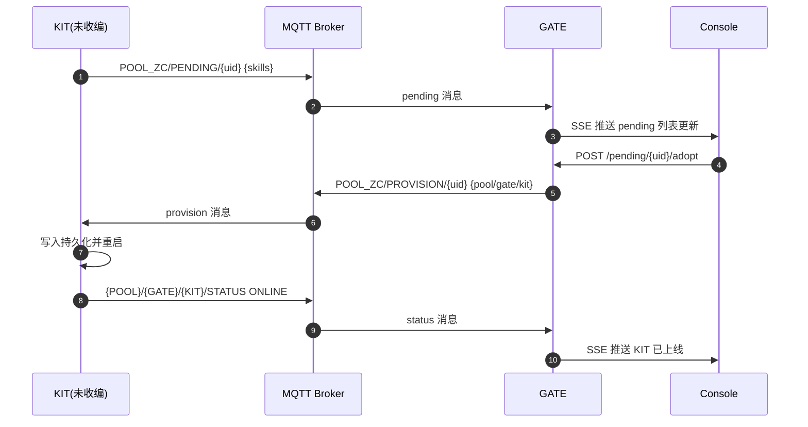

**工程要点**：

1. pending 与 provision 必须走同一 `pending_pool_id`，避免跨池错配。  
2. adopt 接口需要校验 KIT ID 命名规则与冲突关系。  
3. KIT 收到 provision 后重启是关键动作，若不重启会残留旧上下文。  
4. 首次上线必须携带 skills 列表，否则后续 EVENT 不可配置。  
5. 收编成功后应在前端形成可审计时间线（谁在何时收编了哪台设备）。

### 32.2 时序二：EVENT 触发与动作回写

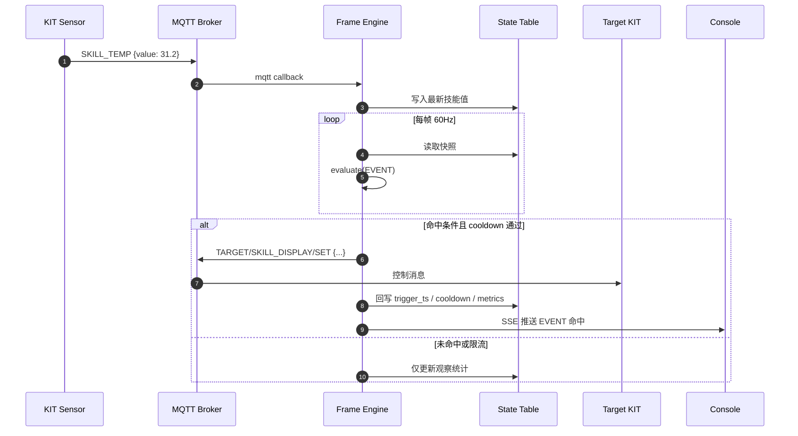

**工程要点**：

1. 规则计算应基于快照而非实时可变引用，避免中间态撕裂。  
2. 动作发布与状态回写分离，确保失败时可定位是哪一步异常。  
3. 前端应显示“命中但未执行”的原因（如 cooldown/离线/目标不可用）。  
4. 对高频传感器建议设置采样与最小变化阈值，降低噪声触发。  
5. 规则指标建议按 EVENT 维度累计：`evaluated`, `triggered`, `blocked`, `error`。

### 32.3 时序三：离线检测与故障隔离

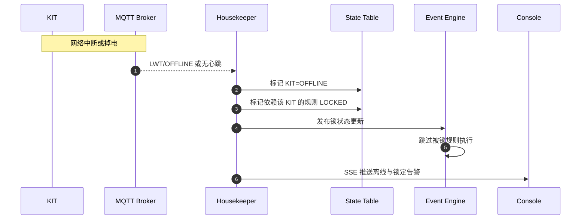

**工程要点**：

1. 离线语义必须统一：LWT 触发与超时扫描都应收敛到同一状态。  
2. 规则锁定应具备“原因字段”，便于前端解释为何不能触发。  
3. 恢复上线后不应立即解除所有锁，建议经过一段稳定窗口再解锁。  
4. 若目标是安全控制场景，离线默认动作应偏保守（Fail-Safe）。  
5. 每次离线事件应沉淀可导出的 incident 记录。

---

## 33. POOL 状态表详细设计与数据治理规范

### 33.1 状态表分层结构

状态表建议按“配置层、发现层、设备层、规则层、诊断层”分层管理：

| 层级 | 关键键 | 写入来源 | 读取消费者 | 变更频率 |
| --- | --- | --- | --- | --- |
| 配置层 | `profile` | setup/api | 全模块 | 低 |
| 发现层 | `discovered_pools`,`pending_kits` | mqtt/discovery | setup/ui | 中 |
| 设备层 | `kits`,`skills` | mqtt/listener | engine/ui | 高 |
| 规则层 | `events`,`event_runtime` | api/engine | engine/ui | 中高 |
| 诊断层 | `errors`,`metrics`,`incidents` | engine/housekeeper/api | ui/ops | 中 |

### 33.2 推荐对象模型（JSON 示意）

```json
{
  "profile": {
    "pool_id": "POOL_HALL_A",
    "pool_name": "Immersive Hall A",
    "gate_id": "GATE_01",
    "gate_name": "MAGI-01",
    "configured": true
  },
  "kits": {
    "KIT_A1": {
      "uid": "001122334455A1",
      "name": "入口温湿度节点",
      "status": "ONLINE",
      "last_seen": 1712345678,
      "skills": {
        "SKILL_TEMP": { "value": 26.8, "ts": 1712345678 },
        "SKILL_HUM": { "value": 61.2, "ts": 1712345678 }
      }
    }
  },
  "events": {
    "TEMP_ALERT_A": {
      "enabled": true,
      "mode": "form",
      "cooldown_ms": 5000,
      "runtime": {
        "last_trigger_ts": 1712345600,
        "status": "OK",
        "error": null
      }
    }
  }
}
```

### 33.3 并发读写规范

1. MQTT 回调写入、规则引擎写入、API 写入都必须通过统一状态入口。  
2. 外部模块不得直接持有可变引用并跨帧复用。  
3. 读取快照时允许深拷贝，写回时必须最小化粒度。  
4. 对同一对象的多来源写入应定义优先级（例如离线状态优先于普通心跳）。  
5. 遇到写冲突应记录冲突计数与最后覆盖来源。

### 33.4 运行态 TTL 与垃圾回收建议

| 数据对象 | 建议 TTL | 清理策略 |
| --- | --- | --- |
| `pending_kits` | 10-30 分钟 | 超时未收编自动标注过期 |
| `discovered_pools` | 30-120 秒 | 周期重采样，过期剔除 |
| `event_runtime` 历史 | 7-30 天 | 滚动窗口或按条数裁剪 |
| `errors` 明细 | 3-30 天 | 聚合保留，明细归档 |
| `incidents` | 90 天或按策略 | 导出后清理 |

### 33.5 可观测字段建议

建议每条关键状态都包含以下元信息：

- `updated_at`：最后更新时间  
- `updated_by`：更新来源（mqtt/api/engine/housekeeper）  
- `revision`：单调递增版本号（便于排查覆盖）  
- `source_topic`：若来自 MQTT，记录原主题  
- `trace_id`：跨模块追踪标识（可选）

这样在故障定位时，能快速回答“谁改的、何时改的、为什么改的”。

---

## 34. EVENT 规则工程化指南（设计、开发、审计、上线）

### 34.1 规则生命周期建议

| 阶段 | 状态 | 负责人 | 关键动作 | 出口条件 |
| --- | --- | --- | --- | --- |
| 设计 | draft | 业务+研发 | 明确目标与影响范围 | 审核通过 |
| 开发 | testing | 研发 | 实现与联调 | 测试通过 |
| 灰度 | canary | 运维+现场 | 小范围验证 | 运行稳定 |
| 生产 | prod | 运维 | 全量启用 | 监控稳定 |
| 下线 | archived | 运维+业务 | 停用并保留审计 | 文档闭环 |

### 34.2 表单模式规范模板

```json
{
  "id": "TEMP_ALERT_A",
  "name": "A区温度告警",
  "mode": "form",
  "enabled": true,
  "source": { "kit_id": "KIT_A1", "skill_id": "SKILL_TEMP" },
  "operator": ">=",
  "threshold": 30.0,
  "target": { "kit_id": "KIT_A1", "skill_id": "SKILL_DISPLAY" },
  "action": { "msg": "温度过高", "duration": 5000 },
  "cooldown_ms": 10000,
  "tags": ["safety", "hall-a"]
}
```

### 34.3 代码模式规范模板

```python
def evaluate(ctx):
    temp = ctx["get"]("KIT_A1", "SKILL_TEMP")
    hum = ctx["get"]("KIT_A1", "SKILL_HUM")
    online = ctx["is_online"]("KIT_A1")
    if not online:
        return False
    if temp is None or hum is None:
        return False
    if temp >= 30 and hum >= 75:
        return {
            "trigger": True,
            "actions": [
                {
                    "target_kit": "KIT_A1",
                    "target_skill": "SKILL_DISPLAY",
                    "payload": {"msg": "高温高湿预警", "duration": 5000}
                }
            ]
        }
    return False
```

### 34.4 规则审计清单

1. 是否存在明确业务目标与可验证成功条件；  
2. 是否限定影响范围（POOL/GATE/KIT）；  
3. 是否设置冷却与频率上限；  
4. 是否处理空值、离线与非法值；  
5. 是否具备回滚策略；  
6. 是否在文档中记录负责人与版本。

### 34.5 规则风险分级

| 等级 | 典型动作 | 风险特征 | 上线要求 |
| --- | --- | --- | --- |
| L1 | 屏幕提示/日志记录 | 可逆、无物理风险 | 自测 + 单人评审 |
| L2 | 继电器开关/灯光切换 | 影响体验和能耗 | 联调 + 双人评审 |
| L3 | 多设备联动链 | 失败传播范围大 | 预演 + 灰度 + 审批 |
| L4 | 安防/安全相关动作 | 误触发代价高 | 白名单 + 严格审计 |

### 34.6 规则可观测性指标

| 指标 | 含义 | 建议阈值 |
| --- | --- | --- |
| `rule_eval_qps` | 每秒评估次数 | 与帧率和规则数相关 |
| `rule_trigger_rate` | 命中率 | 长期过高需检查阈值 |
| `rule_block_rate` | 被阻断率 | 冷却或离线导致 |
| `rule_error_rate` | 错误率 | 应趋近 0 |
| `rule_p95_latency` | 评估耗时 P95 | 单规则建议 < 5ms |

---

## 35. 前端控制台信息架构与交互组件规范

### 35.1 信息架构（IA）建议

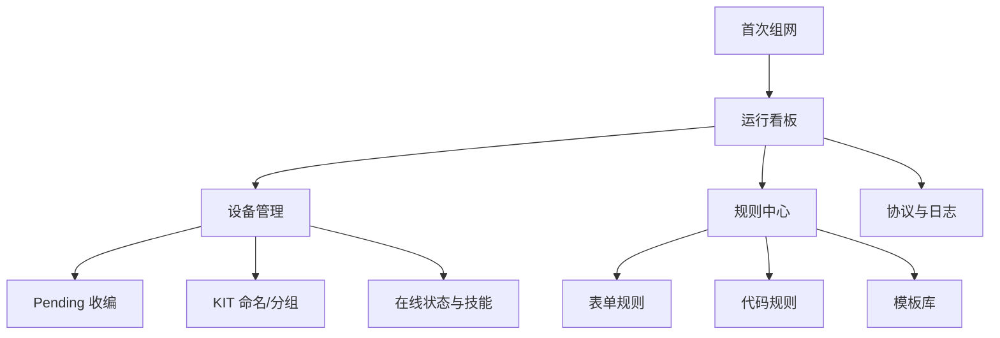

### 35.2 页面级组件建议

| 页面 | 核心组件 | 交互关键点 | 易错点 |
| --- | --- | --- | --- |
| 首次组网 | POOL 发现列表、创建向导 | 一次性绑定确认 | 误重复提交 |
| 运行看板 | 状态卡片、告警时间线 | 秒级刷新 | 状态闪烁 |
| 设备管理 | pending 表格、技能面板 | 收编与命名并行 | 离线设备误操作 |
| 规则中心 | 规则列表、编辑器、版本注记 | 启停与审计清晰 | 修改未保存 |
| 协议日志 | topic 过滤、错误分组 | 快速检索 | 关键字段缺失 |

### 35.3 交互一致性基线

1. 主按钮文案统一动词语义：`创建`、`收编`、`启用`、`停用`、`删除`；  
2. 危险动作统一红色 + 二次确认 + 风险提示；  
3. 状态标签统一语义色：ONLINE/LOCKED/OFFLINE/ERROR；  
4. 所有失败操作给出“可执行建议”，而非只显示错误码；  
5. 输入框编辑中必须具备脏状态保护，防止 SSE 覆盖。

### 35.4 可视化卡片建议

| 卡片 | 建议展示字段 |
| --- | --- |
| POOL 卡 | pool_id、pool_name、gate_count、kit_count、event_count |
| GATE 卡 | gate_id、在线时长、frame_hz、announce_status |
| KIT 卡 | kit_id、name、status、last_seen、skills_count |
| EVENT 卡 | event_id、mode、enabled、last_trigger、error_status |

### 35.5 前端异常提示规范

建议错误提示统一包含三段信息：

1. **发生了什么**：例如“收编失败：KIT ID 不符合命名规范”；  
2. **为什么发生**：例如“仅允许 KIT_[A-Z0-9]{1,5}”；  
3. **你可以怎么做**：例如“请修改为 KIT_A1 后重试”。

这样能显著降低一线运维沟通成本。

---

## 36. SRE 指标体系与现场巡检策略

### 36.1 核心 SLI/SLO 建议

| 维度 | SLI 指标 | 建议 SLO（Alpha） | 备注 |
| --- | --- | --- | --- |
| 可用性 | GATE API 可用率 | >= 99.0% | 局域网场景 |
| 实时性 | 规则触发端到端延迟 P95 | <= 300ms | 业务可感知阈值 |
| 稳定性 | 规则错误率 | <= 1% | 需持续下降 |
| 接入能力 | KIT 收编成功率 | >= 98% | 含重试 |
| 恢复能力 | 离线识别时间 | <= 15s | 含 LWT/扫描 |

### 36.2 现场巡检清单（班前/班中/班后）

| 时段 | 必检项 | 通过标准 |
| --- | --- | --- |
| 班前 | Broker 连接、GATE 进程、核心 KIT 在线 | 全绿 |
| 班中 | 告警数量、规则错误率、离线波动 | 可控阈值内 |
| 班后 | 事件回放、异常归档、配置备份 | 全部完成 |

### 36.3 告警分级建议

| 级别 | 条件示例 | 响应时效 | 责任角色 |
| --- | --- | --- | --- |
| P1 | 核心 GATE 离线、规则引擎停摆 | 立即 | 值班工程师 |
| P2 | 关键区域 KIT 连续离线 | 5-10 分钟 | 运维 |
| P3 | 单设备异常、非关键规则报错 | 30 分钟 | 现场维护 |
| P4 | 低风险提示类异常 | 日内 | 产品/研发 |

### 36.4 变更窗口管理

建议采用“双窗口”：

1. **发布窗口**：允许规则与配置变更；  
2. **冻结窗口**：仅允许应急修复，不做结构调整。

冻结窗口尤其适用于大型活动、高峰营业、验收阶段。

### 36.5 现场 KPI 看板建议

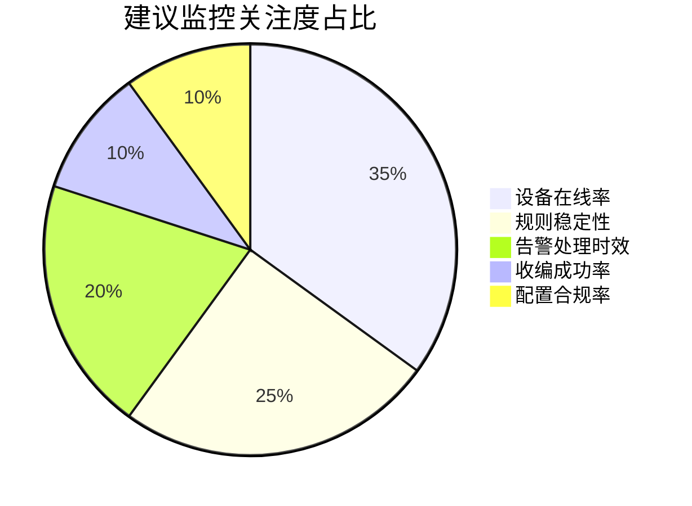

---

## 37. 容量规划、性能预算与扩容路径

### 37.1 简化容量模型

可用以下近似公式进行初步评估：

`评估负载 ≈ KIT数量 × 平均技能数 × 采样频率 × 规则关联系数`

其中，规则关联系数通常在 `0.2 ~ 1.5` 之间，取决于规则是否跨设备、是否多条件组合。

### 37.2 Alpha 建议容量区间

| 场景级别 | KIT 数量 | 单 GATE 建议 | 风险提示 |
| --- | --- | --- | --- |
| 小型 | 1-30 | 单机即可 | 注意命名与规则治理 |
| 中型 | 30-120 | 单机 + 严格规则预算 | 留意峰值抖动 |
| 大型 | 120-300 | 建议拆分多 GATE | 需进入 Beta Mesh 规划 |

### 37.3 帧循环预算建议

| 阶段 | 预算（16.6ms） | 说明 |
| --- | --- | --- |
| 快照读取 | 1.5-3.0ms | 依赖状态规模 |
| 规则计算 | 6.0-10.0ms | 主要瓶颈 |
| 冷却与过滤 | 1.0-2.0ms | 快路径 |
| 动作发射 | 1.0-2.0ms | 异步队列化 |
| 回写与推送 | 1.5-3.0ms | 包含 SSE |

### 37.4 扩容优先级建议

1. 优先优化规则质量（减少无效评估）；  
2. 其次优化状态结构（减少深层复制成本）；  
3. 再考虑拆分 GATE（按 POOL 子域划分）；  
4. 最后再引入跨 GATE 增量同步。

### 37.5 版本化扩容路线（建议）

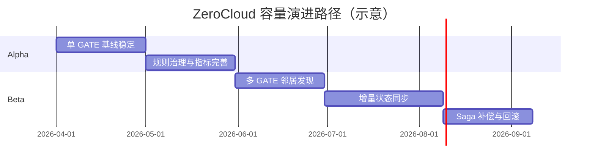

---

## 38. 多场景部署拓扑蓝图（从单馆到园区）

ZeroCloud 的部署策略应与业务组织结构绑定，而不是单纯按“设备数量”拆分。以下给出三类常见拓扑。

### 38.1 拓扑 A：单馆单 POOL 单 GATE（Alpha 标准）

适用：单空间、低至中规模设备、团队较小。  
优势：部署简单、认知一致、排障路径短。  
风险：单点容量上限明显。

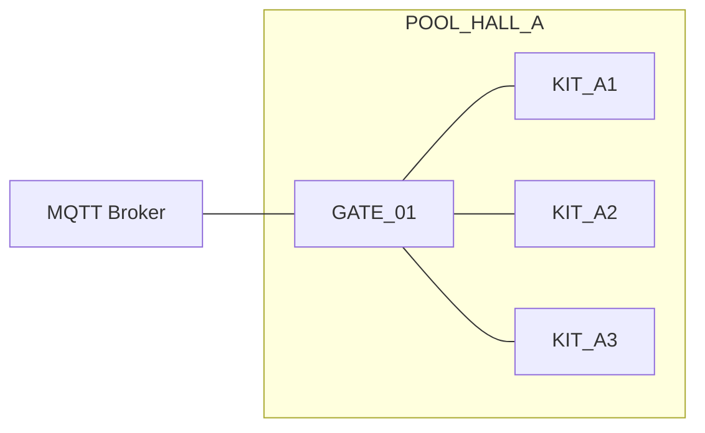

### 38.2 拓扑 B：多馆多 POOL 多 GATE（同城集中运维）

适用：同城市多个门店或展馆，每个场地自治。  
优势：故障域隔离，变更互不影响。  
风险：跨馆数据与版本治理复杂度上升。

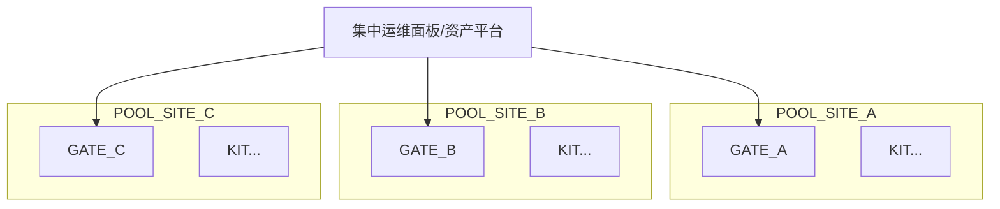

### 38.3 拓扑 C：园区级多 GATE Mesh（Beta 目标）

适用：单 POOL 内多个物理区域，高实时联动需求。  
优势：近端闭环、局部自治、可横向扩展。  
风险：一致性、冲突解决、网络分区处理复杂。

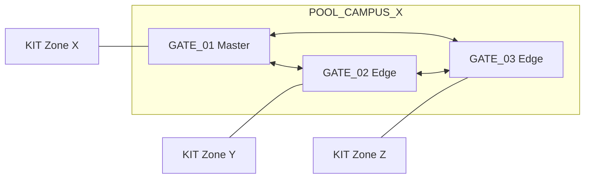

### 38.4 拓扑选型决策表

| 决策维度 | 单 GATE | 多 GATE（独立池） | 多 GATE Mesh |
| --- | --- | --- | --- |
| 部署难度 | 低 | 中 | 高 |
| 运维复杂度 | 低 | 中 | 高 |
| 故障隔离 | 中 | 高 | 中高 |
| 跨区域联动 | 低 | 低 | 高 |
| 扩容弹性 | 中 | 高 | 高 |
| 适合阶段 | Alpha | Alpha/Beta | Beta+ |

### 38.5 现场网络建议

1. GATE 与 Broker 优先同网段，减少跨网抖动。  
2. 若必须跨网段，建议固定路由与 ACL 白名单。  
3. 设备 Wi-Fi 与运维管理网可逻辑隔离，降低误操作面。  
4. 对关键区域启用网络质量监测（丢包、抖动、延迟）。  
5. 任何网络改造前先冻结规则变更，避免双变量排障。

---

## 39. 管理 API 参考（工程落地版）

本节不是替代 OpenAPI，而是提供“面向一线实施”的接口速查表，强调参数、前置条件、常见失败原因。

### 39.1 Profile 与组网接口

| 方法 | 路径 | 用途 | 前置条件 | 典型失败 |
| --- | --- | --- | --- | --- |
| GET | `/api/v1/profile` | 获取当前绑定配置 | GATE 已启动 | 配置文件损坏 |
| PUT | `/api/v1/profile` | 更新显示名称 | 已完成首次组网 | 字段非法 |
| GET | `/api/v1/pools/discovered` | 查看周边池 | discovery 开启 | 广播未启用 |
| POST | `/api/v1/setup/join` | 首次加入已有池 | 未配置状态 | 已配置锁定 |
| POST | `/api/v1/setup/create` | 首次创建新池 | 未配置状态 | pool_id 冲突 |

### 39.2 KIT 管理接口

| 方法 | 路径 | 用途 | 请求关键字段 | 典型失败 |
| --- | --- | --- | --- | --- |
| GET | `/api/v1/pending` | 查看待收编列表 | - | pending 为空 |
| POST | `/api/v1/pending/{uid}/adopt` | 收编设备 | `kit_id`,`pending_pool_id` | KIT ID 非法、UID冲突处理异常 |
| GET | `/api/v1/kits` | 获取设备列表 | 可选过滤参数 | 状态缓存过期 |
| PATCH | `/api/v1/kits/{kit_id}/name` | 改名 | `kit_name` | KIT 不存在 |
| DELETE | `/api/v1/kits/{kit_id}` | 删除设备 | `force=true` 可强删 | 在线设备误删 |
| POST | `/api/v1/kits/{kit_id}/display` | 显示控制 | `msg`,`duration` | 设备离线 |
| POST | `/api/v1/kits/{kit_id}/reset` | 下发重置 | `source` | 权限不足（后续） |

### 39.3 EVENT 管理接口

| 方法 | 路径 | 用途 | 关键字段 | 典型失败 |
| --- | --- | --- | --- | --- |
| GET | `/api/v1/events` | 规则列表 | - | 文件损坏 |
| GET | `/api/v1/events/skills` | 可用技能清单 | - | 设备未上报 |
| GET | `/api/v1/events/templates` | 模板列表 | - | 模板加载失败 |
| GET | `/api/v1/events/code-framework` | 代码框架 | - | 版本不兼容 |
| POST | `/api/v1/events` | 创建规则 | mode/form字段 | skill 不存在 |
| PUT | `/api/v1/events/{event_id}` | 更新规则 | 全量或部分字段 | 规则不存在 |
| POST | `/api/v1/events/{event_id}/enabled` | 启停规则 | `enabled` | 规则锁定 |
| DELETE | `/api/v1/events/{event_id}` | 删除规则 | - | 规则不存在 |

### 39.4 状态流接口

| 方法 | 路径 | 用途 | 输出说明 |
| --- | --- | --- | --- |
| GET | `/api/v1/state` | 拉取全量状态 | 用于初始化渲染 |
| GET | `/api/v1/stream` | SSE 实时推送 | 用于增量刷新 |

### 39.5 API 设计建议

1. 所有写接口返回统一 envelope（success/data/error_code/message）。  
2. 写接口尽量幂等，重复提交应可预测。  
3. 错误码与文案分离：程序看错误码，人看提示文案。  
4. 高风险接口留审计钩子字段（operator、reason、ticket_id）。  
5. 对批量接口预留 `dry_run` 模式，降低现场误操作风险。

### 39.6 接口测试建议矩阵

| 维度 | 示例 | 期望 |
| --- | --- | --- |
| 正向 | 收编合法 KIT | 成功并上线 |
| 边界 | KIT ID 最短/最长 | 合法值通过、非法值拒绝 |
| 异常 | 缺失字段、非法 JSON | 明确错误码 |
| 并发 | 重复收编同 UID | 走合并逻辑 |
| 回归 | 旧版本 payload | 兼容或明确拒绝 |

---

## 40. 配置项字典（.env / 运行参数 / 风险说明）

### 40.1 基础配置表

| 变量名 | 默认值 | 必填 | 作用 | 风险 |
| --- | --- | --- | --- | --- |
| `ZC_POOL_ID` | `POOL_ZC` | 是 | POOL 标识 | 与现场规范冲突 |
| `ZC_POOL_NAME` | `ZeroCloud_Main_Pool` | 是 | POOL 显示名 | 多语言显示不一致 |
| `ZC_GATE_ID` | `GATE_01` | 是 | GATE 标识 | 重复导致资产冲突 |
| `ZC_GATE_NAME` | `MAGI-01` | 是 | GATE 显示名 | 运维识别困难 |
| `MQTT_HOST` | `127.0.0.1` | 是 | Broker 地址 | 地址错误导致全链路不可用 |
| `MQTT_PORT` | `1883` | 是 | Broker 端口 | 与 TLS 策略冲突 |

### 40.2 引擎配置表

| 变量名 | 默认值 | 推荐范围 | 说明 |
| --- | --- | --- | --- |
| `MAGI_FRAME_HZ` | `60` | `30-120` | 帧率越高 CPU 越敏感 |
| `OFFLINE_TIMEOUT_SEC` | `10` | `5-30` | 离线判定阈值 |
| `POOL_ANNOUNCE_INTERVAL_SEC` | `5` | `2-30` | 广播频率 |
| `EVENT_MAX_EXEC_MS` | `50` | `20-100` | code 模式单次上限 |
| `SSE_PUSH_INTERVAL_MS` | `300` | `100-1000` | 推送节流 |

### 40.3 安全配置表（建议新增）

| 变量名 | 示例 | 说明 |
| --- | --- | --- |
| `MQTT_USERNAME` | `zc_gate` | Broker 鉴权用户 |
| `MQTT_PASSWORD` | `***` | Broker 鉴权密码 |
| `MQTT_TLS_ENABLED` | `0/1` | 是否启用 TLS |
| `API_AUTH_ENABLED` | `0/1` | 管理接口鉴权开关 |
| `API_TOKEN` | `***` | 简化令牌（Alpha） |

### 40.4 配置管理流程建议

1. `.env.example` 只放非敏感默认值；  
2. 生产 `.env` 由运维系统下发，不进仓库；  
3. 变更配置必须留有变更记录与回滚版本；  
4. 每次配置变更后执行最小健康检查；  
5. 敏感参数尽量分离到私有密钥系统（后续演进）。

### 40.5 配置审计最小集

| 审计字段 | 示例 |
| --- | --- |
| 变更人 | `ops_user_01` |
| 变更时间 | `2026-04-10 10:20` |
| 变更项 | `OFFLINE_TIMEOUT_SEC: 10 -> 8` |
| 变更原因 | `降低离线告警滞后` |
| 回滚版本 | `config_backup_20260410_1000` |

---

## 41. 安全加固实施手册（Alpha->Beta 可持续路径）

### 41.1 身份与权限

| 项目 | Alpha 最小实践 | Beta 建议实践 |
| --- | --- | --- |
| MQTT 鉴权 | 用户名密码 | mTLS + ACL 分层 |
| API 鉴权 | Token 或网段白名单 | JWT/OIDC + RBAC |
| 高危操作 | 二次确认 | 审批流 + 工单关联 |
| 审计记录 | 文本日志 | 结构化审计流水 |

### 41.2 网络与传输

1. 内网可用明文 MQTT，但必须隔离网段并限制入口。  
2. 半公网或跨站点环境建议启用 TLS 与双向认证。  
3. 禁止将管理端口直接暴露到公网。  
4. Broker 应开启连接数、发布频率、topic ACL 限制。  
5. 前端静态资源建议固定版本与完整性校验。

### 41.3 主机与进程

| 层面 | 建议 |
| --- | --- |
| 账户 | 非 root 运行服务 |
| 目录权限 | 数据目录最小权限 |
| 服务管理 | systemd 或 supervisor 统一管理 |
| 日志策略 | 分级 + 滚动 + 保留周期 |
| 升级策略 | 先灰度后全量 |

### 41.4 数据与隐私

1. 默认只采集运行必要数据，不采集无关个人信息。  
2. 设备标识与现场资产可做匿名映射，降低暴露风险。  
3. 导出日志时可选脱敏（IP/UID 部分掩码）。  
4. 跨组织共享问题日志时避免包含密钥与具体地址。  
5. 明确数据留存策略与删除策略。

### 41.5 安全应急模板

| 事件类型 | 触发条件 | 立即动作 | 后续动作 |
| --- | --- | --- | --- |
| 密钥泄露 | 发现凭证外泄 | 立刻轮换密钥 | 追溯影响范围 |
| 非法控制 | 检测异常 topic | 封禁来源 + 冻结高危接口 | 审计复盘 |
| 批量离线 | 大量 KIT 下线 | 启动故障演练流程 | 网络与电源排查 |
| 配置误改 | 大面积规则异常 | 回滚配置备份 | 增加变更门禁 |

---

## 42. 测试体系与验收设计（研发、实施、运营共用）

### 42.1 测试分层模型

| 层级 | 目标 | 代表测试 |
| --- | --- | --- |
| 单元测试 | 模块逻辑正确 | 规则解析、命名校验 |
| 集成测试 | 模块协同正确 | MQTT->状态->规则->动作 |
| 端到端测试 | 用户路径正确 | 收编到联动全流程 |
| 现场验收测试 | 交付可运行 | 离线恢复、应急演练 |

### 42.2 最小回归集（建议每次发布执行）

1. GATE 启动、API 可访问、前端可打开；  
2. 新 KIT pending 可见、adopt 成功、status 在线；  
3. 表单规则可创建并触发动作；  
4. 代码规则可创建并处理空值；  
5. KIT 离线后规则自动锁定；  
6. reset-gate 后可重新完成首次组网。

### 42.3 验收案例模板（可复用）

| 用例编号 | 前置条件 | 步骤 | 期望结果 |
| --- | --- | --- | --- |
| AC-001 | GATE 正常 | 上电未收编 KIT | pending 列表出现 UID |
| AC-002 | AC-001 通过 | 执行 adopt | KIT 重启后 STATUS ONLINE |
| AC-003 | AC-002 通过 | 创建温度阈值规则 | 条件命中后显示控制触发 |
| AC-004 | AC-003 通过 | 断开 KIT 网络 | 规则进入 LOCKED |
| AC-005 | 任意状态 | 执行 reset-gate | 恢复首次组网状态 |

### 42.4 缺陷分级建议

| 等级 | 定义 | 示例 |
| --- | --- | --- |
| Blocker | 系统不可用 | GATE 无法启动 |
| Critical | 核心链路失效 | 收编流程中断 |
| Major | 主要功能异常 | 规则无法保存 |
| Minor | 次要体验问题 | 文案错误 |
| Trivial | 低影响优化 | 排版细节 |

### 42.5 质量看板建议

建议持续跟踪：

- 发布前缺陷总量与趋势  
- 回归通过率  
- 高风险规则占比  
- 现场 incident 数量与关闭时效  
- 版本回滚次数

---

## 43. 故障演练与应急处置 Runbook

### 43.1 演练场景建议

| 场景 | 目的 | 演练动作 | 通过标准 |
| --- | --- | --- | --- |
| Broker 短时不可用 | 验证恢复弹性 | 断开 Broker 30s 后恢复 | 系统自动恢复 |
| 核心 KIT 离线 | 验证隔离链路 | 断网或断电 KIT | 规则锁定 + 告警可见 |
| 错误规则发布 | 验证回滚能力 | 发布故障规则 | 快速停用并回滚 |
| 配置误改 | 验证备份策略 | 修改关键 env | 可在规定时间内恢复 |
| 大流量冲击 | 验证容量余量 | 提高采样频率 | 无雪崩 |

### 43.2 应急处置四步法

1. **止血**：先阻止影响扩大（停用高危规则/隔离来源）。  
2. **定位**：按链路检查（设备->MQTT->状态->规则->动作->UI）。  
3. **恢复**：回滚配置、恢复服务、验证关键路径。  
4. **复盘**：沉淀原因、补上门禁、更新文档。

### 43.3 典型故障定位顺序

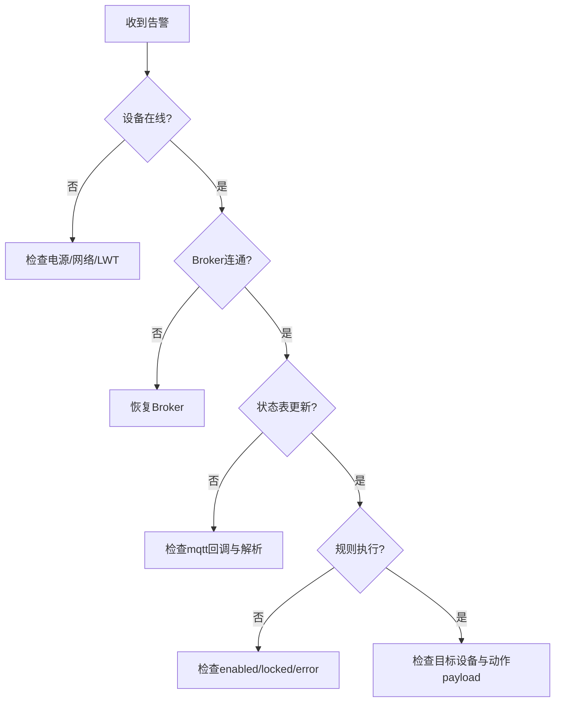

### 43.4 复盘模板（建议）

| 字段 | 示例 |
| --- | --- |
| 事件编号 | INC-2026-0410-001 |
| 影响范围 | POOL_HALL_A, KIT_A1-A3 |
| 发现时间 | 2026-04-10 19:31 |
| 恢复时间 | 2026-04-10 19:47 |
| 根因 | Broker ACL 误改 |
| 临时修复 | 回滚 ACL 配置 |
| 永久措施 | 增加变更审批与自动校验 |

---

## 44. 交付与运维组织模型（角色、流程、边界）

### 44.1 角色建议

| 角色 | 核心职责 | 关键产出 |
| --- | --- | --- |
| 系统负责人 | 架构与版本决策 | ADR、版本计划 |
| 后端工程师 | GATE 与 API | 服务代码与接口文档 |
| 固件工程师 | KIT 协议实现 | 固件版本与兼容说明 |
| 前端工程师 | 控制台体验与状态一致性 | 页面与交互规范 |
| 运维工程师 | 部署、监控、应急 | runbook、巡检记录 |
| 现场实施 | 设备接入、资产对齐、验收执行 | 资产清单、验收报告 |

### 44.2 交付流程建议

1. 需求冻结与 POOL 划分；  
2. 设备清单与技能词典确认；  
3. 规则清单初版设计；  
4. 实验室联调与用例验证；  
5. 现场部署与收编；  
6. 联动调优与演练；  
7. 验收签收与运维移交。

### 44.3 交付文档清单（正式版）

| 编号 | 文档名称 | 是否必须 |
| --- | --- | --- |
| D01 | 系统总手册（本文件） | 是 |
| D02 | 部署与回滚手册 | 是 |
| D03 | 设备资产清单（UID 对照） | 是 |
| D04 | 规则清单与风险分级表 | 是 |
| D05 | 巡检与应急 Runbook | 是 |
| D06 | 变更日志与版本说明 | 是 |
| D07 | 安全基线与权限表 | 建议 |
| D08 | 培训材料与上手指南 | 建议 |

### 44.4 跨团队协作边界

1. 业务逻辑归规则层，硬件侧不承载业务分支。  
2. 协议字段变更需三方评审（后端/固件/前端）。  
3. 现场改动必须回灌仓库文档与配置模板。  
4. 运维可执行但不可绕过治理（例如直接改生产规则）。  
5. 所有“紧急修改”必须在 24h 内补齐记录。

---

## 45. 开源协作与社区贡献机制（建议）

### 45.1 分支与发布策略

| 分支 | 作用 | 允许内容 |
| --- | --- | --- |
| `main` | 稳定发布线 | 仅已验证改动 |
| `develop` | 集成开发线 | 功能集成 |
| `feature/*` | 功能开发 | 新功能 |
| `fix/*` | 缺陷修复 | Bug 修复 |
| `docs/*` | 文档改进 | 文档与图表 |

### 45.2 Pull Request 最小模板建议

1. 变更背景与目标  
2. 影响范围（协议/API/UI/固件）  
3. 风险评估与回滚方式  
4. 验证方式与证据  
5. 文档是否同步更新（必选项）

### 45.3 Issue 分类建议

| 类型 | 标签建议 | 用途 |
| --- | --- | --- |
| Bug | `bug` `severity/*` | 缺陷跟踪 |
| Feature | `enhancement` | 新能力提案 |
| Docs | `documentation` | 文档改进 |
| Security | `security` | 安全问题 |
| Question | `question` | 使用咨询 |

### 45.4 贡献者友好实践

1. 保持脚本可直接运行（降低门槛）；  
2. 提供最小 demo 与样例 payload；  
3. 关键模块给出“为什么这样做”；  
4. 评审意见聚焦正确性与可维护性；  
5. 对外发布版本附带迁移说明。

### 45.5 社区成熟度指标（建议）

| 指标 | 目标方向 |
| --- | --- |
| PR 响应时间 | 持续下降 |
| 文档覆盖率 | 持续上升 |
| 回归自动化比例 | 持续上升 |
| 协议兼容性问题数 | 持续下降 |
| 现场复现型 issue 占比 | 持续下降 |

---

## 46. 培训体系与团队上手路径（7 天速成方案）

ZeroCloud 的落地速度与团队认知一致性强相关。建议把培训分为“概念、协议、操作、排障、演练”五层，避免只讲概念或只讲命令。

### 46.1 角色化培训地图

| 角色 | 必学内容 | 建议时长 | 结业标准 |
| --- | --- | --- | --- |
| 研发后端 | 状态表、规则引擎、API | 2 天 | 能独立定位规则异常 |
| 研发前端 | SSE 状态流、交互保护 | 1 天 | 能修复输入覆盖问题 |
| 固件工程师 | 生命周期协议、技能自描述 | 2 天 | 能接入一类新 SKILL |
| 运维工程师 | 部署、巡检、应急流程 | 1 天 | 能完成故障演练 |
| 实施人员 | 收编、命名、验收清单 | 1 天 | 能独立完成现场交付 |

### 46.2 建议课程安排

| 日程 | 主题 | 实操任务 |
| --- | --- | --- |
| Day 1 | 架构与术语统一 | 画出本项目 POOL/GATE/KIT 拓扑 |
| Day 2 | 协议与收编流程 | 完成 pending->provision->status 全链路 |
| Day 3 | 规则与模板实战 | 编写 3 条表单规则 + 1 条代码规则 |
| Day 4 | 前端与运维视角 | 完成告警可视化与巡检脚本 |
| Day 5 | 安全与变更治理 | 执行一次配置变更 + 回滚 |
| Day 6 | 故障演练 | 演练离线、超时、规则错误三类故障 |
| Day 7 | 综合验收 | 现场模拟交付与文档提交 |

### 46.3 实操评分维度（建议）

| 维度 | 权重 | 评分点 |
| --- | --- | --- |
| 协议正确性 | 30% | topic 与 payload 是否合规 |
| 规则可靠性 | 25% | 是否处理空值/离线/冷却 |
| 排障能力 | 25% | 是否按链路定位并恢复 |
| 文档完整性 | 20% | 是否沉淀配置与变更记录 |

### 46.4 培训常见误区

1. 只讲功能，不讲边界；  
2. 只记命令，不懂语义；  
3. 只看成功路径，不练失败路径；  
4. 只看控制台，不看 MQTT 主题；  
5. 只靠个人经验，不沉淀团队文档。

---

## 47. 运营期变更管理（CAB）与发布流程

### 47.1 变更类型分级

| 类型 | 例子 | 风险等级 | 审批建议 |
| --- | --- | --- | --- |
| 配置变更 | 超时阈值、名称修改 | 低-中 | 值班 + 记录 |
| 规则变更 | 阈值调整、动作变更 | 中-高 | 双人评审 |
| 协议变更 | topic/字段新增 | 高 | 三方评审 + 灰度 |
| 结构变更 | 多 GATE 拆分 | 高 | 专项评审 |
| 安全变更 | 鉴权策略切换 | 高 | 安全负责人审批 |

### 47.2 发布前检查（Pre-flight）

1. 当前版本备份是否完整（profile/kits/events）；  
2. 是否有可执行回滚路径；  
3. 是否处于允许发布窗口；  
4. 是否完成最小回归集；  
5. 是否已通知现场值班人员。

### 47.3 发布中策略

| 步骤 | 要点 |
| --- | --- |
| 灰度发布 | 先在非核心区域启用 |
| 观测窗口 | 持续观察关键指标 10-30 分钟 |
| 小步快跑 | 每次只改一类变量，便于定位 |
| 可回滚 | 任一步骤异常立即回滚 |

### 47.4 发布后复核（Post-check）

1. 核心 KIT 在线率是否恢复；  
2. 规则错误率是否上升；  
3. 告警是否异常增多；  
4. 前端是否出现状态抖动；  
5. 文档与配置基线是否同步更新。

### 47.5 CAB 记录模板

| 字段 | 示例 |
| --- | --- |
| CAB 编号 | CAB-2026-0410-01 |
| 变更范围 | EVENT 模板阈值调整 |
| 影响对象 | POOL_HALL_A |
| 风险评估 | 中 |
| 执行人 | dev_ops_01 |
| 审批人 | lead_01 |
| 回滚方案 | 恢复 events.json 备份 |
| 结果 | 成功/回滚/部分成功 |

---

## 48. 数据报表与经营视角指标（让系统服务业务）

边缘系统的目标不是“技术好看”，而是“业务可运营”。建议从经营视角建立指标：客流体验、故障影响时长、能耗与维护效率。

### 48.1 业务指标示例

| 指标 | 计算建议 | 价值 |
| --- | --- | --- |
| 互动触发成功率 | 成功动作 / 总触发请求 | 评估体验稳定性 |
| 平均恢复时长 MTTR | 故障恢复总时长 / 故障数 | 评估运维效率 |
| 设备可用时长 | 在线时长 / 总时长 | 评估硬件稳定性 |
| 规则可用率 | 非错误规则数 / 总规则数 | 评估规则质量 |
| 日常巡检完成率 | 完成巡检项 / 应巡检项 | 评估运营纪律 |

### 48.2 技术指标与业务指标映射

| 技术指标 | 业务影响 |
| --- | --- |
| 规则延迟 P95 上升 | 互动反馈变慢，用户感知下降 |
| KIT 离线频次升高 | 现场体验中断，投诉概率上升 |
| 收编成功率下降 | 新设备上线效率下降 |
| 错误规则占比升高 | 运维负担增加，事故风险上升 |
| 配置回滚次数频繁 | 变更策略不成熟 |

### 48.3 报表节奏建议

| 周期 | 建议输出 |
| --- | --- |
| 日报 | 在线率、告警、故障闭环 |
| 周报 | 规则稳定性趋势、变更质量 |
| 月报 | 交付质量、运营成本、优化计划 |

### 48.4 经营复盘问题单（建议）

1. 本周最影响体验的 3 个问题是什么？  
2. 这些问题是设备问题、规则问题还是流程问题？  
3. 哪些问题可以通过标准化模板避免再次发生？  
4. 哪个 POOL 的治理方式可作为最佳实践复制？  
5. 下周最值得投入的改进项是什么？

---

## 49. Beta 演进设计蓝图（从稳定到规模）

### 49.1 Alpha 到 Beta 的核心差异

| 维度 | Alpha_260409 | Beta 目标 |
| --- | --- | --- |
| 拓扑 | 单 GATE 单 POOL 基线 | 多 GATE 增量同步 |
| 一致性 | 单机内存单源 | 跨节点状态协调 |
| 容错 | 本地恢复为主 | 跨节点补偿链路 |
| 规则治理 | 单点发布 | 版本化 + 灰度 |
| 可观测 | 基础日志与状态 | 统一指标与轨迹 |

### 49.2 增量同步建议模型

1. 同步对象限定：`profile_delta`, `kit_presence`, `event_meta`；  
2. 不同步高频原始传感器值（避免网络膨胀）；  
3. 使用版本号与时间戳解决冲突；  
4. 支持“仅主节点写配置，边缘节点读执行”；  
5. 网络分区恢复后执行增量回放。

### 49.3 Saga 补偿机制建议

| 阶段 | 主动作 | 补偿动作 |
| --- | --- | --- |
| A | 打开设备 A | 失败则关闭 A |
| B | 下发设备 B | 失败则回滚 A |
| C | 写入状态表 | 失败则标记部分成功并告警 |

### 49.4 规则版本化建议

| 字段 | 说明 |
| --- | --- |
| `rule_id` | 规则逻辑身份，不随版本变化 |
| `version` | 语义版本，如 `v1.2.0` |
| `status` | draft/canary/prod/rollback |
| `change_log` | 版本变更说明 |
| `compatibility` | 对 KIT/GATE 兼容约束 |

### 49.5 Beta 成熟度门槛

1. 单点故障不导致全域失效；  
2. 规则灰度与回滚可在分钟级完成；  
3. 关键指标可视化且可追溯；  
4. 演练体系覆盖跨节点故障；  
5. 文档、工具、流程三位一体。

---

## 50. 附录 C：标准消息样例库（可直接复用）

### C.1 收编类消息

#### C.1.1 Pending 示例（带扩展字段）

```json
{
  "uid": "001122334455A1B2",
  "skills": ["SKILL_TEMP", "SKILL_HUM", "SKILL_DISPLAY"],
  "firmware": "1.0.3",
  "hw_rev": "esp32c6-ref-a",
  "ts": 1712345678
}
```

#### C.1.2 Provision 示例（含命名与标签）

```json
{
  "pool_id": "POOL_HALL_A",
  "gate_id": "GATE_01",
  "kit_id": "KIT_A1",
  "kit_name": "入口温湿度节点",
  "tags": ["hall-a", "env-sensor"]
}
```

### C.2 运行类消息

#### C.2.1 STATUS ONLINE

```json
{
  "status": "ONLINE",
  "uid": "001122334455A1B2",
  "skills": ["SKILL_TEMP", "SKILL_HUM", "SKILL_DISPLAY"],
  "ip": "192.168.1.88",
  "rssi": -58,
  "ts": 1712345678
}
```

#### C.2.2 STATUS OFFLINE

```json
{
  "status": "OFFLINE",
  "reason": "LWT",
  "ts": 1712345699
}
```

#### C.2.3 温度上报

```json
{
  "value": 27.6,
  "unit": "C",
  "ts": 1712345700
}
```

#### C.2.4 湿度上报

```json
{
  "value": 63.4,
  "unit": "%RH",
  "ts": 1712345700
}
```

### C.3 控制类消息

#### C.3.1 显示控制

```json
{
  "msg": "温度偏高，请注意通风",
  "duration": 5000,
  "priority": "normal"
}
```

#### C.3.2 继电器控制

```json
{
  "value": 1,
  "source": "GATE_01",
  "reason": "EVENT_TEMP_ALERT"
}
```

#### C.3.3 系统重置

```json
{
  "source": "GATE_01",
  "reason": "manual_maintenance",
  "ts": 1712345755
}
```

### C.4 诊断类消息

#### C.4.1 规则错误事件

```json
{
  "event_id": "TEMP_ALERT_A",
  "status": "ERROR",
  "error_code": "SKILL_UNKNOWN",
  "message": "SKILL_TEMP_X not found",
  "ts": 1712345800
}
```

#### C.4.2 告警推送事件

```json
{
  "level": "P2",
  "component": "KIT_A1",
  "message": "device offline detected",
  "ts": 1712345822
}
```

---

## 51. 附录 D：EVENT 模板库（建议初始集）

### D.1 环境类模板

| 模板 ID | 模式 | 触发条件 | 目标动作 |
| --- | --- | --- | --- |
| `TMP_HIGH_WARN` | form | 温度 >= 阈值 | 屏幕提示 |
| `TMP_LOW_WARN` | form | 温度 <= 阈值 | 屏幕提示 |
| `HUM_HIGH_WARN` | form | 湿度 >= 阈值 | 屏幕提示 |
| `TMP_HUM_COMBO` | code | 温度高且湿度高 | 多动作联动 |
| `ENV_RECOVER` | code | 指标恢复正常 | 取消提示 |

### D.2 安防类模板

| 模板 ID | 模式 | 触发条件 | 目标动作 |
| --- | --- | --- | --- |
| `PIR_INTRUSION` | form | PIR=1 | 蜂鸣 + 显示 |
| `DOOR_TIMEOUT` | code | 门磁持续打开超时 | 告警推送 |
| `MULTI_ZONE_TRIGGER` | code | 多区域连续触发 | 高等级告警 |

### D.3 运营类模板

| 模板 ID | 模式 | 触发条件 | 目标动作 |
| --- | --- | --- | --- |
| `OPENING_SCENE` | form | 营业开始时间 | 场景灯光切换 |
| `CLOSING_SCENE` | form | 营业结束时间 | 设备节能模式 |
| `PEAK_MODE` | code | 客流高峰检测 | 动态调节提示策略 |

### D.4 模板维护规范

1. 模板必须带用途说明和风险等级；  
2. 模板默认值要保守，避免误触发；  
3. 每次模板调整都记录变更日志；  
4. 模板实例化后允许局部改写，但应保留来源；  
5. 高风险模板需二次审批。

### D.5 模板示例：温湿复合告警

```json
{
  "template_id": "TMP_HUM_COMBO",
  "name": "温湿复合告警",
  "mode": "code",
  "required_skills": ["KIT_A1.SKILL_TEMP", "KIT_A1.SKILL_HUM"],
  "params": {
    "temp_threshold": 30,
    "hum_threshold": 75,
    "message": "高温高湿，请立即处理",
    "cooldown_ms": 15000
  }
}
```

---

## 52. 附录 E：检查清单全集（可打印执行）

### E.1 上线前检查清单

| 检查项 | 结果 | 备注 |
| --- | --- | --- |
| GATE 服务可启动 | [ ]通过 [ ]失败 |  |
| 控制台可访问 | [ ]通过 [ ]失败 |  |
| MQTT 连通正常 | [ ]通过 [ ]失败 |  |
| 核心 KIT 已收编 | [ ]通过 [ ]失败 |  |
| 关键规则已启用 | [ ]通过 [ ]失败 |  |
| 回滚包已准备 | [ ]通过 [ ]失败 |  |
| 文档版本已同步 | [ ]通过 [ ]失败 |  |

### E.2 日常巡检清单

| 检查项 | 频率 | 通过标准 |
| --- | --- | --- |
| 在线率 | 每小时 | >= 95% |
| 规则错误率 | 每小时 | <= 1% |
| 告警处理时效 | 每班次 | <= 15 分钟 |
| 备份任务 | 每日 | 成功 |
| 日志空间 | 每日 | 足够 |

### E.3 变更执行清单

1. 是否明确变更窗口；  
2. 是否通知值班与业务方；  
3. 是否准备回滚脚本；  
4. 是否完成变更后复核；  
5. 是否归档变更记录。

### E.4 故障恢复清单

| 步骤 | 完成 |
| --- | --- |
| 确认影响范围 | [ ] |
| 执行止血动作 | [ ] |
| 恢复核心链路 | [ ] |
| 验证业务恢复 | [ ] |
| 输出复盘记录 | [ ] |

---

## 53. 附录 F：FAQ（现场高频 30 问）

### F.1 协议与收编

1. **为什么 KIT 上电后看不到 pending？**  
   通常是 topic 不匹配、Broker 不通、或 GATE 未订阅正确路径。优先抓包验证 `POOL_ZC/PENDING/{uid}` 是否真实发出。

2. **为什么 adopt 之后 KIT 还是 pending？**  
   可能是 KIT 未订阅 provision 主题、写入持久化失败、或重启后仍连接旧网络。

3. **KIT ID 能否用小写或短横线？**  
   不建议。当前规则是 `KIT_[A-Z0-9]{1,5}`，保持统一能减少运维混乱。

4. **同一个 UID 为何不新建设备？**  
   系统默认合并旧记录，避免资产碎片化。

5. **可以跳过 STATUS 直接上报技能吗？**  
   不建议。STATUS 是能力自描述与生命周期语义起点。

### F.2 规则与引擎

6. **规则明明创建了为什么不触发？**  
   常见原因：未启用、目标离线、cooldown 生效、技能值为空、规则被锁。

7. **代码模式必须写 evaluate(ctx) 吗？**  
   是。它是执行入口，返回 bool 或动作对象。

8. **规则能否直接访问网络或文件系统？**  
   不建议。应限制在受控上下文，避免安全与稳定风险。

9. **为什么建议先用表单模式？**  
   表单模式可视化和可审计能力更强，适合团队协作与现场运维。

10. **规则触发太频繁怎么办？**  
    增加 cooldown、阈值滞回、最小变化量过滤。

### F.3 运维与部署

11. **为什么强调 reset-gate 脚本？**  
    因为现场必须有“可恢复起点”，否则问题会积累。

12. **配置改错了怎么办？**  
    按回滚清单恢复 `.env` 和持久化备份，然后重启服务。

13. **能否直接改生产 events.json？**  
    不建议。应通过 API + 审计流程，避免状态不一致。

14. **前端显示不更新怎么办？**  
    检查 SSE 连接、浏览器缓存、后端推送是否正常。

15. **为什么离线设备还能被操作？**  
    说明锁定链路异常，需要检查 Housekeeper 与状态同步。

### F.4 交付与治理

16. **为什么文档要这么详细？**  
    因为项目可持续性来自“可复制知识”，不是“记忆中的经验”。

17. **谁可以改规则？**  
    建议按风险分级授权，高风险规则必须审批。

18. **如何避免多人同时改配置冲突？**  
    使用变更窗口和 CAB 记录，单窗口只允许单责任人操作。

19. **交付后谁负责持续维护？**  
    建议明确主责角色，并保留升级与应急支持机制。

20. **如何判断项目是否进入 Beta 条件？**  
    看稳定性指标、演练覆盖率、治理闭环、文档成熟度是否达标。

### F.5 进阶问题

21. **多 GATE 同池时如何避免冲突？**  
    需要版本号、写入主从策略、冲突解决规则。

22. **是否需要外部数据库？**  
    Alpha 不强制；当规模、审计和历史分析需求上升时再引入。

23. **如何做规则灰度？**  
    按 KIT 分组或区域分组启用，观察后逐步放量。

24. **如何控制日志体积？**  
    结构化日志 + 分级采样 + 归档策略。

25. **如何评估规则质量？**  
    看触发准确率、错误率、回滚次数、运维反馈。

26. **可否接入非 MQTT 协议设备？**  
    可以，通过适配层映射为 SKILL 与标准 topic 语义。

27. **如何做离线场景仿真？**  
    网络断开、设备断电、Broker 阻断三类组合演练。

28. **如何进行容量压测？**  
    提升上报频率与规则数量，观察 p95 延迟和错误率。

29. **是否支持多语言 UI？**  
    建议通过 i18n 词典实现，不改变核心语义字段。

30. **文档多久更新一次？**  
    每次版本发布必须更新；重大 incident 后应立即补充。

---

## 54. 附录 G：术语英中对照表（便于跨团队协同）

| 中文术语 | 英文术语 | 说明 |
| --- | --- | --- |
| 逻辑域 | Pool | 资源与命名边界 |
| 边缘中枢 | Gate | 状态与规则执行中心 |
| 执行终端 | Kit | 感知与控制节点 |
| 技能 | Skill | 设备能力契约 |
| 规则 | Event Rule | 条件到动作编排 |
| 待收编 | Pending | 未入网设备状态 |
| 收编下发 | Provision | 配置分配动作 |
| 状态消息 | Status | 生命周期语义 |
| 清道夫 | Housekeeper | 离线扫描与治理 |
| 帧引擎 | Frame Engine | 固定频率规则判定 |
| 单一事实源 | Single Source of Truth | 统一状态入口 |
| 冷却时间 | Cooldown | 防抖与限频机制 |
| 遗嘱消息 | Last Will and Testament | 异常离线通知 |
| 增量同步 | Incremental Sync | 变更级状态传播 |
| 灰度发布 | Canary Release | 小范围验证发布 |
| 补偿链路 | Saga Compensation | 失败回滚链 |

---

## 55. 附录 H：版本迁移剧本（Alpha_260409 -> 后续版本）

### H.1 迁移前准备

1. 完整备份 `profile.json` / `kits.json` / `events.json`；  
2. 导出当前规则清单与状态快照；  
3. 记录现网关键指标基线（在线率/延迟/错误率）；  
4. 确认回滚包可用；  
5. 明确迁移窗口与责任人。

### H.2 迁移步骤建议

| 步骤 | 动作 | 验证 |
| --- | --- | --- |
| M1 | 停止写入高风险规则 | 规则列表冻结 |
| M2 | 升级后端服务 | API 健康检查通过 |
| M3 | 升级前端资源 | 页面可访问且状态同步 |
| M4 | 执行数据迁移脚本（若有） | 状态完整 |
| M5 | 恢复规则执行 | 核心规则触发正常 |
| M6 | 开启观测窗口 | 指标稳定 |

### H.3 迁移后验收

1. 收编流程是否仍兼容旧 KIT；  
2. 历史规则是否可读取并运行；  
3. 新增字段是否有默认兼容值；  
4. 告警策略是否工作正常；  
5. 文档与运维清单是否同步更新。

### H.4 回滚触发条件（建议）

| 条件 | 说明 |
| --- | --- |
| 核心链路不可用 > 5 分钟 | 必须回滚 |
| 规则错误率飙升并持续 | 建议回滚 |
| 大面积设备离线无法恢复 | 必须回滚 |
| 关键接口不兼容旧流程 | 必须回滚 |

### H.5 迁移完成声明模板

> 本次升级已完成，版本由 `Alpha_260409` 迁移至 `X.Y.Z`。  
> 核心链路（收编、状态上报、规则执行、前端展示）验证通过，关键指标在可接受范围内。  
> 已完成文档同步、配置归档、风险复盘。后续将进入观察期并持续跟踪运行质量。

---

## 56. 结语（正式版）

ZeroCloud 的方法论可以浓缩为一句话：**先把边界定义清楚，再把复杂性放到可治理的位置。**  
POOL 让业务空间可组织，GATE 让决策与状态可治理，KIT 让硬件能力可替换。  
当协议稳定、规则可审计、流程可恢复、文档可追溯时，系统就不再是“个人英雄式工程”，而是“团队可持续工程”。

Alpha_260409 的价值，正是建立了这条可持续路径的基线。  
接下来无论你走向多站点复制，还是迈向多 GATE Mesh，核心都不变：  
**用清晰语义降低协作成本，用工程纪律换取长期稳定。**

---

## 57. 附录 I：错误码与处理动作全表（建议实现）

为避免现场沟通成本，建议所有错误统一采用：`模块_类型_编号` 格式，例如 `EVENT_VALIDATE_001`。

### 57.1 收编与生命周期错误码

| 错误码 | 场景 | 说明 | 处理动作 |
| --- | --- | --- | --- |
| `ADOPT_VALIDATE_001` | 收编 | KIT ID 为空 | 前端阻止提交 |
| `ADOPT_VALIDATE_002` | 收编 | KIT ID 非法格式 | 返回命名规范提示 |
| `ADOPT_VALIDATE_003` | 收编 | pending_pool_id 缺失 | 要求补齐参数 |
| `ADOPT_STATE_001` | 收编 | UID 不存在 | 提示刷新 pending 列表 |
| `ADOPT_STATE_002` | 收编 | UID 已被并发收编 | 返回冲突并建议重试 |
| `LIFE_STATUS_001` | 生命周期 | status 字段缺失 | 丢弃消息并告警 |
| `LIFE_STATUS_002` | 生命周期 | status 非法值 | 标记异常消息 |
| `LIFE_STATUS_003` | 生命周期 | skills 非数组 | 拒绝更新技能表 |
| `LIFE_STATUS_004` | 生命周期 | kit_id 缺失 | 归档到异常池 |
| `LIFE_STATUS_005` | 生命周期 | uid 与历史冲突 | 触发合并或告警 |

### 57.2 协议与消息错误码

| 错误码 | 场景 | 说明 | 处理动作 |
| --- | --- | --- | --- |
| `TOPIC_PARSE_001` | MQTT | topic 段数不合法 | 记录并丢弃 |
| `TOPIC_PARSE_002` | MQTT | 段位语义不匹配 | 记录并告警 |
| `TOPIC_PARSE_003` | MQTT | 非法字符 | 记录并告警 |
| `PAYLOAD_JSON_001` | MQTT | JSON 解析失败 | 保存摘要 |
| `PAYLOAD_SCHEMA_001` | MQTT | 缺失必填字段 | 返回错误 |
| `PAYLOAD_SCHEMA_002` | MQTT | 字段类型错误 | 返回错误 |
| `PAYLOAD_SCHEMA_003` | MQTT | 字段越界 | 截断或拒绝 |
| `MQTT_CONN_001` | 网络 | Broker 连接失败 | 指数退避重连 |
| `MQTT_CONN_002` | 网络 | 认证失败 | 触发 P1 告警 |
| `MQTT_CONN_003` | 网络 | 订阅失败 | 记录并重试 |

### 57.3 规则引擎错误码

| 错误码 | 场景 | 说明 | 处理动作 |
| --- | --- | --- | --- |
| `EVENT_VALIDATE_001` | 创建规则 | mode 非法 | 拒绝保存 |
| `EVENT_VALIDATE_002` | 创建规则 | source skill 不存在 | 拒绝保存 |
| `EVENT_VALIDATE_003` | 创建规则 | target skill 不存在 | 拒绝保存 |
| `EVENT_VALIDATE_004` | 创建规则 | cooldown 非法 | 使用默认或拒绝 |
| `EVENT_EXEC_001` | 执行 | evaluate 未定义 | 标记 ERROR |
| `EVENT_EXEC_002` | 执行 | 返回值非法 | 标记 ERROR |
| `EVENT_EXEC_003` | 执行 | 执行超时 | 中断并标记 ERROR |
| `EVENT_EXEC_004` | 执行 | 获取 skill 失败 | 标记 ERROR |
| `EVENT_EXEC_005` | 执行 | 动作 payload 非法 | 跳过并告警 |
| `EVENT_EXEC_006` | 执行 | 目标 kit 离线 | 阻断并计数 |

### 57.4 API 与前端错误码

| 错误码 | 场景 | 说明 | 处理动作 |
| --- | --- | --- | --- |
| `API_AUTH_001` | API | 未授权访问 | 返回 401 |
| `API_AUTH_002` | API | token 失效 | 返回 401 |
| `API_REQ_001` | API | 请求参数非法 | 返回 400 |
| `API_REQ_002` | API | 请求体过大 | 返回 413 |
| `API_STATE_001` | API | 资源不存在 | 返回 404 |
| `API_STATE_002` | API | 资源冲突 | 返回 409 |
| `API_STATE_003` | API | 系统未配置 | 返回 423 |
| `UI_SYNC_001` | 前端 | SSE 连接断开 | 自动重连 |
| `UI_FORM_001` | 前端 | 输入冲突 | 提示保存草稿 |
| `UI_RENDER_001` | 前端 | 技能渲染失败 | 回退到原始视图 |

### 57.5 存储与恢复错误码

| 错误码 | 场景 | 说明 | 处理动作 |
| --- | --- | --- | --- |
| `STORE_IO_001` | 存储 | 文件不存在 | 初始化默认结构 |
| `STORE_IO_002` | 存储 | 权限不足 | 告警并阻止写入 |
| `STORE_IO_003` | 存储 | 写入失败 | 重试并告警 |
| `STORE_IO_004` | 存储 | JSON 损坏 | 尝试恢复备份 |
| `BACKUP_001` | 备份 | 备份失败 | 阻止发布 |
| `BACKUP_002` | 备份 | 回滚失败 | 升级 P1 |

---

## 58. 附录 J：SKILL 扩展词典（建议 40 项）

下面给出可扩展的 SKILL 词典。项目可按行业裁剪，但建议保持命名风格和 payload 结构一致。

| SKILL | 类型 | 单位 | 上报 | 控制 | 说明 |
| --- | --- | --- | --- | --- | --- |
| SKILL_TEMP | float | C | 是 | 否 | 温度 |
| SKILL_HUM | float | %RH | 是 | 否 | 湿度 |
| SKILL_PIR | bool/int | - | 是 | 否 | 人体红外 |
| SKILL_LIGHT | int | lux | 是 | 否 | 光照 |
| SKILL_CO2 | int | ppm | 是 | 否 | 二氧化碳 |
| SKILL_PM25 | float | ug/m3 | 是 | 否 | PM2.5 |
| SKILL_NOISE | float | dB | 是 | 否 | 噪声 |
| SKILL_VOC | float | ppb | 是 | 否 | VOC |
| SKILL_SMOKE | bool | - | 是 | 否 | 烟雾报警 |
| SKILL_FLAME | bool | - | 是 | 否 | 火焰检测 |
| SKILL_DOOR | bool | - | 是 | 否 | 门磁状态 |
| SKILL_WINDOW | bool | - | 是 | 否 | 窗磁状态 |
| SKILL_WATER_LEAK | bool | - | 是 | 否 | 漏水检测 |
| SKILL_POWER | float | W | 是 | 否 | 功率 |
| SKILL_ENERGY | float | kWh | 是 | 否 | 电量累计 |
| SKILL_CURRENT | float | A | 是 | 否 | 电流 |
| SKILL_VOLTAGE | float | V | 是 | 否 | 电压 |
| SKILL_RELAY | bool/int | - | 可选 | 是 | 继电器 |
| SKILL_DIMMER | int | % | 可选 | 是 | 调光 |
| SKILL_RGB | json | - | 可选 | 是 | RGB 灯效 |
| SKILL_DISPLAY | json | - | 可选 | 是 | 屏幕显示 |
| SKILL_BUZZER | json | - | 可选 | 是 | 蜂鸣器 |
| SKILL_SERVO | json | deg | 可选 | 是 | 舵机角度 |
| SKILL_MOTOR | json | rpm | 可选 | 是 | 电机控制 |
| SKILL_FAN | int | level | 可选 | 是 | 风扇档位 |
| SKILL_AC | json | - | 可选 | 是 | 空调模式 |
| SKILL_HEATER | int | level | 可选 | 是 | 加热器 |
| SKILL_LOCK | bool | - | 可选 | 是 | 门锁开关 |
| SKILL_CAMERA | json | - | 可选 | 是 | 摄像头控制 |
| SKILL_SPEAKER | json | - | 可选 | 是 | 语音播放 |
| SKILL_PROJECTOR | json | - | 可选 | 是 | 投影控制 |
| SKILL_CURTAIN | json | % | 可选 | 是 | 窗帘控制 |
| SKILL_HUMIDIFIER | int | level | 可选 | 是 | 加湿器 |
| SKILL_DEHUMIDIFIER | int | level | 可选 | 是 | 除湿器 |
| SKILL_AIR_PURIFIER | int | level | 可选 | 是 | 空净控制 |
| SKILL_SCENE | json | - | 可选 | 是 | 场景切换 |
| SKILL_ALARM | json | - | 可选 | 是 | 告警器 |
| SKILL_GATEWAY_HEALTH | json | - | 是 | 否 | 网关健康状态 |
| SKILL_BATTERY | float | % | 是 | 否 | 电池电量 |
| SKILL_SIGNAL | int | dBm | 是 | 否 | 信号强度 |

### 58.1 命名与语义原则

1. 名称尽量短而明确，避免语义重叠；  
2. 相同技能在不同硬件上的单位必须一致；  
3. 控制型技能建议使用标准动作：`SET`、`RESET`、`MODE`；  
4. 对复合载荷（json）需在文档给出字段说明；  
5. 每新增技能必须同步到词典和示例。

### 58.2 推荐 payload 约定

| 类型 | 推荐字段 |
| --- | --- |
| 标量型 | `{"value":x,"ts":...}` |
| 带单位 | `{"value":x,"unit":"...","ts":...}` |
| 控制型 | `{"value":x,"source":"...","reason":"..."}` |
| 复合型 | `{"mode":"...","params":{...},"ts":...}` |

---

## 59. 附录 K：规则模板细化（含 12 条示例）

### K.1 示例 1：温度高告警（表单）

```json
{
  "id": "RULE_TEMP_HIGH_A",
  "mode": "form",
  "enabled": true,
  "source": {"kit_id": "KIT_A1", "skill_id": "SKILL_TEMP"},
  "operator": ">=",
  "threshold": 30,
  "target": {"kit_id": "KIT_A1", "skill_id": "SKILL_DISPLAY"},
  "action": {"msg": "温度偏高", "duration": 5000},
  "cooldown_ms": 10000
}
```

### K.2 示例 2：湿度高告警（表单）

```json
{
  "id": "RULE_HUM_HIGH_A",
  "mode": "form",
  "enabled": true,
  "source": {"kit_id": "KIT_A1", "skill_id": "SKILL_HUM"},
  "operator": ">=",
  "threshold": 75,
  "target": {"kit_id": "KIT_A1", "skill_id": "SKILL_DISPLAY"},
  "action": {"msg": "湿度偏高", "duration": 5000},
  "cooldown_ms": 15000
}
```

### K.3 示例 3：温湿复合（代码）

```python
def evaluate(ctx):
    t = ctx["get"]("KIT_A1", "SKILL_TEMP")
    h = ctx["get"]("KIT_A1", "SKILL_HUM")
    if t is None or h is None:
        return False
    if t >= 30 and h >= 75:
        return {"trigger": True, "actions": [{
            "target_kit": "KIT_A1",
            "target_skill": "SKILL_DISPLAY",
            "payload": {"msg": "高温高湿", "duration": 5000}
        }]}
    return False
```

### K.4 示例 4：离线告警（代码）

```python
def evaluate(ctx):
    if not ctx["is_online"]("KIT_A1"):
        return {"trigger": True, "actions": [{
            "target_kit": "KIT_B1",
            "target_skill": "SKILL_DISPLAY",
            "payload": {"msg": "KIT_A1 离线", "duration": 8000}
        }]}
    return False
```

### K.5 示例 5：营业开场场景（表单/时间触发）

```json
{
  "id": "RULE_OPENING_SCENE",
  "mode": "form",
  "enabled": true,
  "source": {"kit_id": "KIT_SYS", "skill_id": "SKILL_CLOCK"},
  "operator": "==",
  "threshold": "09:30",
  "target": {"kit_id": "KIT_LIGHT_1", "skill_id": "SKILL_SCENE"},
  "action": {"scene": "OPENING", "fade_ms": 3000},
  "cooldown_ms": 60000
}
```

### K.6 示例 6：营业闭场场景

```json
{
  "id": "RULE_CLOSING_SCENE",
  "mode": "form",
  "enabled": true,
  "source": {"kit_id": "KIT_SYS", "skill_id": "SKILL_CLOCK"},
  "operator": "==",
  "threshold": "22:00",
  "target": {"kit_id": "KIT_LIGHT_1", "skill_id": "SKILL_SCENE"},
  "action": {"scene": "CLOSING", "fade_ms": 5000},
  "cooldown_ms": 60000
}
```

### K.7 示例 7：噪声超标提醒

```json
{
  "id": "RULE_NOISE_WARN",
  "mode": "form",
  "enabled": true,
  "source": {"kit_id": "KIT_A2", "skill_id": "SKILL_NOISE"},
  "operator": ">=",
  "threshold": 85,
  "target": {"kit_id": "KIT_A2", "skill_id": "SKILL_DISPLAY"},
  "action": {"msg": "噪声过高，请降低音量", "duration": 4000},
  "cooldown_ms": 12000
}
```

### K.8 示例 8：CO2 超标联动新风

```json
{
  "id": "RULE_CO2_FAN_ON",
  "mode": "form",
  "enabled": true,
  "source": {"kit_id": "KIT_ENV", "skill_id": "SKILL_CO2"},
  "operator": ">=",
  "threshold": 1200,
  "target": {"kit_id": "KIT_FAN", "skill_id": "SKILL_FAN"},
  "action": {"value": 3},
  "cooldown_ms": 15000
}
```

### K.9 示例 9：客流高峰灯光增强（代码）

```python
def evaluate(ctx):
    p1 = ctx["get"]("KIT_ENTRANCE", "SKILL_PIR")
    p2 = ctx["get"]("KIT_HALL", "SKILL_PIR")
    if p1 and p2:
        return {"trigger": True, "actions": [{
            "target_kit": "KIT_LIGHT_1",
            "target_skill": "SKILL_DIMMER",
            "payload": {"value": 90}
        }]}
    return False
```

### K.10 示例 10：设备恢复提示

```json
{
  "id": "RULE_RECOVER_NOTICE",
  "mode": "code",
  "enabled": true,
  "description": "设备由离线恢复在线后广播提示",
  "cooldown_ms": 30000
}
```

### K.11 示例 11：漏水紧急联动

```json
{
  "id": "RULE_WATER_EMERGENCY",
  "mode": "form",
  "enabled": true,
  "source": {"kit_id": "KIT_WATER", "skill_id": "SKILL_WATER_LEAK"},
  "operator": "==",
  "threshold": 1,
  "target": {"kit_id": "KIT_RELAY_MAIN", "skill_id": "SKILL_RELAY"},
  "action": {"value": 0},
  "cooldown_ms": 300000
}
```

### K.12 示例 12：夜间静音模式

```json
{
  "id": "RULE_NIGHT_SILENCE",
  "mode": "form",
  "enabled": true,
  "source": {"kit_id": "KIT_SYS", "skill_id": "SKILL_CLOCK"},
  "operator": "between",
  "threshold": ["23:00", "07:00"],
  "target": {"kit_id": "KIT_SPEAKER", "skill_id": "SKILL_SPEAKER"},
  "action": {"volume": 20},
  "cooldown_ms": 60000
}
```

---

## 60. 附录 L：现场 SOP（标准作业程序）

### 60.1 首次部署 SOP

1. 检查网络与电源；  
2. 部署 Broker 与 GATE；  
3. 完成首次组网（join 或 create）；  
4. 上电 KIT 并收编命名；  
5. 验证状态上报与规则联动；  
6. 执行最小应急演练；  
7. 导出交付基线快照。

### 60.2 日常运营 SOP

| 步骤 | 时间 | 操作 |
| --- | --- | --- |
| 班前巡检 | 开馆前 | 查看在线率与告警 |
| 运行观察 | 营业中 | 跟踪关键规则命中与异常 |
| 班后归档 | 闭馆后 | 导出日志、更新巡检记录 |

### 60.3 故障处置 SOP

1. 接收告警并分级；  
2. 先做止血（停规则/隔离设备）；  
3. 按链路定位根因；  
4. 执行恢复与验证；  
5. 输出 incident 复盘与改进项。

### 60.4 升级发布 SOP

| 阶段 | 操作 |
| --- | --- |
| 发布前 | 备份、检查、通知 |
| 发布中 | 灰度、观测、小步变更 |
| 发布后 | 复核、归档、复盘 |

### 60.5 资产管理 SOP

1. 每台设备贴 UID 标签；  
2. 资产表记录位置、用途、负责人；  
3. 变更设备时同步更新资产表；  
4. 报废与替换走标准流程；  
5. 定期核对资产与系统状态一致性。

---

## 61. 附录 M：性能基准测试方案（建议模板）

### 61.1 基准目标

| 目标 | 指标 |
| --- | --- |
| 引擎稳定 | 帧率波动可控 |
| 规则性能 | p95 耗时可接受 |
| 消息吞吐 | 无明显丢包 |
| UI 实时性 | 状态刷新稳定 |

### 61.2 测试变量

| 变量 | 范围 |
| --- | --- |
| KIT 数量 | 10 / 50 / 100 / 200 |
| 技能数/Kit | 2 / 4 / 8 |
| 上报频率 | 1Hz / 2Hz / 5Hz |
| 规则数量 | 10 / 50 / 100 / 200 |
| code 规则占比 | 0% / 20% / 50% |

### 61.3 采集指标

1. CPU、内存占用；  
2. 每帧耗时分布（p50/p95/p99）；  
3. 规则错误率与阻断率；  
4. MQTT 发布/订阅延迟；  
5. 前端状态延迟。

### 61.4 结果记录模板

| 场景 | CPU | 内存 | 帧耗时P95 | 错误率 | 结论 |
| --- | --- | --- | --- | --- | --- |
| S1 | 25% | 350MB | 8ms | 0.2% | 通过 |
| S2 | 47% | 520MB | 12ms | 0.6% | 通过 |
| S3 | 72% | 780MB | 19ms | 1.8% | 需优化 |

### 61.5 优化策略建议

1. 降低无效规则评估频次；  
2. 为高频技能设置变化阈值；  
3. 减少深层对象复制；  
4. 控制 code 规则复杂度；  
5. 拆分过载 POOL/GATE。

---

## 62. 附录 N：许可证与合规说明（工程实践）

### 62.1 GPLv3 实践要点

1. 发布源码需保留 LICENSE；  
2. 修改后分发需说明变更；  
3. 衍生分发需保持 GPLv3 合规；  
4. 第三方组件需检查兼容性；  
5. 商业交付需明确开源边界与义务。

### 62.2 第三方依赖合规清单（建议）

| 依赖类型 | 示例 | 合规动作 |
| --- | --- | --- |
| Python 包 | FastAPI/Paho | 保留许可证信息 |
| JS 包 | Vue/Tailwind | 锁定版本并审计 |
| 固件库 | ESP32 SDK | 关注二进制分发条款 |

### 62.3 交付合规材料

| 材料 | 是否建议 |
| --- | --- |
| LICENSE 原文 | 必须 |
| 依赖许可证清单 | 建议 |
| 版权声明 | 建议 |
| 版本变更记录 | 必须 |
| 开源义务说明 | 建议 |

---

## 63. 附录 O：文档维护模板与版本记录规范

### 63.1 文档更新模板

| 字段 | 说明 |
| --- | --- |
| 版本号 | 文档版本（对应代码版本） |
| 更新人 | 提交人 |
| 更新时间 | 变更时间 |
| 影响章节 | 章节编号 |
| 变更摘要 | 发生了什么 |
| 兼容性说明 | 是否影响旧版本 |
| 待办事项 | 后续需要跟进 |

### 63.2 版本记录建议格式

```text
Version: Alpha_260409
Date: 2026-04-10
Changes:
- 归档 10 张技术图与 Mermaid 源码
- 补充架构决策记录（ADR）
- 新增 API 参考、SOP、FAQ、迁移剧本
- 文档扩展为正式技术版
Compatibility:
- 保持与 Alpha_260409 协议兼容
```

### 63.3 文档治理建议

1. 把文档更新纳入 PR 必选项；  
2. 关键流程变更必须更新示意图；  
3. 每次 incident 复盘至少补充一条 runbook；  
4. 每次发布同步更新 FAQ；  
5. 定期清理过期章节，避免“文档僵尸”。

---

## 64. 最终交付声明

本手册已覆盖：

1. 架构哲学与职责边界（POOL/GATE/KIT）；  
2. 协议规范与字段字典；  
3. GATE/KIT/前端实现与治理建议；  
4. 规则工程化、运维巡检、应急处置；  
5. 交付流程、培训体系、社区协作；  
6. 多场景拓扑、容量规划、Beta 演进路径；  
7. 标准样例、模板库、SOP、FAQ、迁移剧本。

并且已完成图文资产标准化：

- 图片：`docs/assets/images/01...10-*.png`
- Mermaid 源码：`docs/assets/mermaid/01...10-*.mmd`

该文档可直接作为仓库正式技术说明与交付手册使用。

---

## 65. 附录 P：行业场景实施方案库（可直接选型）

为了让 ZeroCloud 在不同行业快速复用，下面给出“场景目标 -> 设备建议 -> 规则模式 -> 运维重点”的模板化方案。

### 65.1 沉浸式密室场景

| 维度 | 建议 |
| --- | --- |
| 目标 | 剧情联动稳定、低延迟反馈、故障可快速恢复 |
| 设备建议 | PIR、门磁、灯光、继电器、显示屏、蜂鸣器 |
| 规则模式 | 以表单规则为主，关键剧情节点用代码规则 |
| 运维重点 | 演出前巡检、剧情关键点预演、离线自动锁定 |

**落地提示**：

1. 剧情关键联动建议设置多条件保护（防误触）。  
2. 每个关卡规则建议独立命名空间，便于快速定位。  
3. 设备离线后应立即触发替代提示，保障玩家体验连续性。  
4. 高风险动作（门锁、强电）必须双重确认与物理兜底。  
5. 现场人员应掌握“一键降级”流程，保证可运营。

### 65.2 文旅展馆场景

| 维度 | 建议 |
| --- | --- |
| 目标 | 多区域联动、稳定开放运行、可统计分析 |
| 设备建议 | 环境传感器、导览屏、灯控、广播系统 |
| 规则模式 | 时间策略 + 人流策略 + 环境策略组合 |
| 运维重点 | 高峰容错、巡检制度、日报周报机制 |

**落地提示**：

1. 展馆通常存在多区域，建议按 POOL 子域组织 KIT 命名。  
2. 对客流高峰要设置“降噪规则”（减少非必要动作）。  
3. 夜间闭馆策略应自动生效并可手动覆盖。  
4. 指标上建议重点关注“互动成功率 + 平均恢复时长”。  
5. 大型活动前需冻结规则变更窗口。

### 65.3 主题酒店/民宿场景

| 维度 | 建议 |
| --- | --- |
| 目标 | 客房体验一致、设备易维护、故障可远程诊断 |
| 设备建议 | 温湿度、门锁、空调、照明、窗帘、显示屏 |
| 规则模式 | 房态驱动（入住/退房/清洁）+ 时间驱动 |
| 运维重点 | 资产台账、远程诊断、快速替换策略 |

**落地提示**：

1. 房间可作为 POOL 或 POOL 子分区，命名需强约束。  
2. 建议统一房态规则模板，避免每房间独立定制失控。  
3. 设备更换频繁，UID 合并机制必须稳定。  
4. 故障信息应可映射到房间号和工单系统。  
5. 夜间变更需严格控制并保留回滚。

### 65.4 教育实训场景

| 维度 | 建议 |
| --- | --- |
| 目标 | 学生可理解、可实验、可重置 |
| 设备建议 | 传感器套件、显示模块、继电器实验板 |
| 规则模式 | 模板教学 + 代码进阶 |
| 运维重点 | 快速复位、课堂时段隔离、账户管理 |

**落地提示**：

1. 每次课程结束应一键恢复到标准基线。  
2. 学生实验规则需在隔离 POOL 内运行。  
3. 错误反馈要教学友好（解释原因与修复方式）。  
4. 提供“只读观察模式”便于讲解。  
5. 保留课堂版本快照用于复盘。

### 65.5 轻工业看板场景（非安全控制）

| 维度 | 建议 |
| --- | --- |
| 目标 | 设备状态可视化、告警及时、维护可追踪 |
| 设备建议 | 电力、温湿、振动、噪声、显示终端 |
| 规则模式 | 阈值预警 + 趋势告警 |
| 运维重点 | 误报抑制、告警分级、工单闭环 |

**落地提示**：

1. 对噪声与振动类技能建议加入滞回和窗口平均。  
2. 告警推送应与工单系统打通。  
3. 关键设备离线与能耗异常需单独看板。  
4. 强调“告警闭环率”而不是“告警数量”。  
5. 安全控制类动作应交给专用工业系统，ZeroCloud 仅做信息与非关键联动。

### 65.6 场景选型速查表

| 场景 | 推荐规则复杂度 | 推荐发布频率 | 风险关注点 |
| --- | --- | --- | --- |
| 密室 | 中高 | 周级 | 误触发与剧情中断 |
| 展馆 | 中 | 双周/月 | 高峰稳定性 |
| 酒店 | 中 | 月级 | 资产一致性 |
| 教育 | 低中 | 课次级 | 快速恢复 |
| 轻工业看板 | 中 | 月级 | 告警治理 |

---

## 66. 附录 Q：可靠性模式库（规则与系统双层）

### 66.1 去抖（Debounce）模式

**适用**：按钮、PIR、门磁等高抖动信号。  
**做法**：信号连续 N 次一致才判定有效。  
**收益**：减少误触发，提升规则可信度。

### 66.2 滞回（Hysteresis）模式

**适用**：温湿度、噪声等连续量。  
**做法**：设置进入阈值与退出阈值，避免边界反复切换。  
**收益**：降低动作抖动。

### 66.3 冷却（Cooldown）模式

**适用**：动作成本高或用户可感知频闪场景。  
**做法**：同一规则触发后在冷却期内不重复动作。  
**收益**：防止刷屏和设备磨损。

### 66.4 熔断（Circuit Breaker）模式

**适用**：目标设备长期不可达。  
**做法**：连续失败超过阈值后暂时断开动作通道，并定期试探恢复。  
**收益**：避免无效重试拖垮系统。

### 66.5 降级（Degrade）模式

**适用**：高负载或部分依赖不可用。  
**做法**：保留核心规则，暂停非关键规则。  
**收益**：在压力下保持关键体验。

### 66.6 幂等（Idempotent）模式

**适用**：网络重发、重复提交。  
**做法**：相同请求重复执行结果一致。  
**收益**：降低并发与重试风险。

### 66.7 超时（Timeout）模式

**适用**：代码规则、外部调用。  
**做法**：设定最大执行时长，超时即中断并报错。  
**收益**：保护帧循环稳定。

### 66.8 看门狗（Watchdog）模式

**适用**：引擎主循环与关键线程。  
**做法**：定期检测心跳，异常触发重启或告警。  
**收益**：减少长时间假死。

### 66.9 影子发布（Shadow）模式

**适用**：新规则验证。  
**做法**：先只计算不执行，比较结果后再放量。  
**收益**：降低发布风险。

### 66.10 可靠性模式组合建议

| 场景 | 推荐组合 |
| --- | --- |
| 环境告警 | 滞回 + 冷却 |
| 入侵检测 | 去抖 + 幂等 |
| 复杂联动 | 超时 + 熔断 + 回滚 |
| 高峰运营 | 降级 + 影子发布 |

---

## 67. 附录 R：真实复盘样本（模板化示例）

### 67.1 样本 1：收编失败导致开馆延迟

**现象**：开馆前 20 分钟，3 台 KIT 无法完成收编。  
**影响**：入口区环境显示缺失，开馆延迟 15 分钟。  
**根因**：现场固件版本仍订阅旧 provision 路径。  
**处置**：

1. 临时兼容旧路径并重推 provision；  
2. 成功上线后校验 STATUS；  
3. 追加规则锁保护，避免未收编设备被误引用。

**改进动作**：

- 发布前加入固件协议一致性检查；  
- 设备入场验收清单增加“订阅路径核对”；  
- 文档补充旧版本兼容说明。

### 67.2 样本 2：规则误触发引发频闪投诉

**现象**：某展区灯光频繁闪烁，用户投诉。  
**根因**：阈值边界无滞回，且 cooldown 过短。  
**处置**：

1. 立即停用问题规则；  
2. 增加滞回区间与冷却时间；  
3. 影子模式运行 30 分钟验证后恢复。

**改进动作**：

- 规则评审强制检查“滞回与冷却”；  
- 增加规则风险分级；  
- 上线前必须包含边界值测试。

### 67.3 样本 3：Broker ACL 误改导致全域离线

**现象**：多个 KIT 同时离线，控制台告警暴增。  
**根因**：运维误改 ACL，阻断了 publish 权限。  
**处置**：

1. 回滚 ACL 到前一版本；  
2. 恢复后执行在线率核对；  
3. 对关键规则进行手工回放验证。

**改进动作**：

- ACL 变更进入 CAB 审批；  
- 增加自动校验脚本；  
- 夜间禁止高风险网络策略变更。

### 67.4 样本 4：代码规则超时导致引擎抖动

**现象**：帧循环抖动，前端刷新卡顿。  
**根因**：代码规则中存在高复杂度循环，无超时保护。  
**处置**：

1. 停用问题规则并恢复表单规则兜底；  
2. 为代码规则增加执行上限；  
3. 复盘并发布代码规范。

**改进动作**：

- 引入 `EVENT_MAX_EXEC_MS` 强制限制；  
- 规则上线前做静态检查；  
- 高复杂度规则必须灰度验证。

### 67.5 样本 5：文档滞后导致跨团队误解

**现象**：前端按旧字段渲染，显示异常。  
**根因**：后端协议字段已更新但文档未同步。  
**处置**：

1. 紧急修复前端兼容；  
2. 立即补齐文档并发布变更说明；  
3. 追溯流程漏洞。

**改进动作**：

- PR 模板增加“文档同步”必填项；  
- 协议变更要求三方评审；  
- 发布门禁加入文档一致性检查。

---

## 68. 附录 S：字段级校验规则清单（可直接用于实现）

本附录用于把“文档约定”落地为“可执行校验”。建议后端 API、规则编辑器、固件侧共同采用同一份校验词典。

### 68.1 标识符校验规则

| 字段 | 正则建议 | 最小长度 | 最大长度 | 是否区分大小写 | 说明 |
| --- | --- | --- | --- | --- | --- |
| pool_id | `^POOL_[A-Z0-9_]{1,32}$` | 6 | 37 | 是 | 逻辑域 ID |
| gate_id | `^GATE_[A-Z0-9_]{1,16}$` | 6 | 21 | 是 | 网关 ID |
| kit_id | `^KIT_[A-Z0-9]{1,5}$` | 5 | 9 | 是 | 设备 ID（强约束） |
| skill_id | `^SKILL_[A-Z0-9_]{1,32}$` | 7 | 38 | 是 | 能力 ID |
| event_id | `^[A-Z][A-Z0-9_]{2,63}$` | 3 | 64 | 是 | 规则 ID |

### 68.2 数值字段校验规则

| 字段 | 类型 | 范围建议 | 精度建议 | 非法处理 |
| --- | --- | --- | --- | --- |
| temperature.value | float | -20 ~ 80 | 0.1 | 丢弃并告警 |
| humidity.value | float | 0 ~ 100 | 0.1 | 丢弃并告警 |
| co2.value | int | 300 ~ 5000 | 1 | 截断或拒绝 |
| pm25.value | float | 0 ~ 1000 | 0.1 | 截断或拒绝 |
| noise.value | float | 20 ~ 130 | 0.1 | 丢弃并告警 |
| light.value | int | 0 ~ 100000 | 1 | 截断或拒绝 |
| relay.value | int/bool | 0/1 | - | 拒绝 |
| dimmer.value | int | 0 ~ 100 | 1 | 截断或拒绝 |

### 68.3 时间字段校验规则

| 字段 | 格式 | 示例 | 规则 |
| --- | --- | --- | --- |
| ts | epoch 秒/毫秒 | `1712345678` | 必须单调不倒退（允许小范围漂移） |
| clock | `HH:mm` | `09:30` | 24 小时制 |
| duration | int ms | `5000` | 100~600000 |
| cooldown_ms | int ms | `10000` | 0~3600000 |
| timeout_sec | int s | `10` | 1~300 |

### 68.4 规则字段校验规则

| 字段 | 必填 | 规则 |
| --- | --- | --- |
| mode | 是 | 只能是 `form` 或 `code` |
| enabled | 是 | 布尔值 |
| source.kit_id | form 必填 | 需存在且在线可选 |
| source.skill_id | form 必填 | 必须在该 KIT 声明过 |
| operator | form 必填 | `> >= < <= == != between` |
| threshold | form 必填 | 与 skill 类型匹配 |
| target.kit_id | 触发动作时必填 | 需存在 |
| target.skill_id | 触发动作时必填 | 需可控 |
| action | 可选 | JSON 可序列化 |
| code | code 必填 | 必含 `evaluate(ctx)` |

### 68.5 消息体大小与频率限制建议

| 项目 | 建议 |
| --- | --- |
| 单条 payload 大小 | <= 4KB |
| 状态上报频率 | 0.5Hz~2Hz（默认 1Hz） |
| 高频技能上报 | 建议变化阈值触发 |
| 控制消息重试 | 最多 3 次（指数退避） |
| 告警推送节流 | 同类告警 5-30 秒窗口聚合 |

### 68.6 UI 输入校验建议

1. 前端先做快速校验，后端做权威校验；  
2. 错误提示需包含“字段 + 规则 + 修复建议”；  
3. 批量编辑支持预检（dry-run）；  
4. 高风险字段修改需二次确认；  
5. 保存失败保留草稿，避免重复录入。

### 68.7 兼容性校验清单

| 检查项 | 问题示例 | 处理建议 |
| --- | --- | --- |
| 新字段兼容旧端 | 旧固件无法识别新字段 | 字段追加不替换 |
| topic 兼容 | 旧主题仍在使用 | 保留桥接周期 |
| 规则兼容 | 旧规则缺少新字段 | 提供默认值迁移 |
| UI 兼容 | 新状态字段导致旧页面报错 | 前端容错渲染 |
| 数据兼容 | 旧持久化结构不完整 | 启动时迁移补齐 |

### 68.8 校验失败处理优先级

| 优先级 | 范围 | 策略 |
| --- | --- | --- |
| P0 | 影响系统稳定 | 立即阻断并告警 |
| P1 | 影响核心链路 | 阻断并提示修复 |
| P2 | 影响部分功能 | 可降级处理并记录 |
| P3 | 轻微格式问题 | 自动修正并提示 |

---

## 69. 附录 T：交付问答补充（管理层/实施方/甲方）

### 69.1 管理层常见问题

**Q1：为什么需要这么严格的命名规范？**  
A：命名规范是规模化运维的基础。没有强命名，后续跨团队交接和多现场复制都会退化为“人工记忆”，最终形成不可维护的隐性成本。

**Q2：为什么要把规则放在 GATE 而不是 KIT？**  
A：规则变更频率远高于硬件变更频率。将规则上收至 GATE 可以大幅降低固件升级成本，并提升排障效率。

**Q3：为什么要强调文档同步？**  
A：边缘系统的失败通常不是“代码跑不起来”，而是“团队对同一系统理解不一致”。文档同步是协作成本控制手段。

### 69.2 实施方常见问题

**Q4：现场网络质量差怎么办？**  
A：优先保证 Broker 与 GATE 同网段，降低跨网延迟；启用离线容错与规则锁定，保证业务安全边界。

**Q5：设备替换后需要重新建 KIT 吗？**  
A：若 UID 保持一致，一般可走合并重上线流程，不必重建 KIT。

**Q6：如何避免上线当天大量临时改规则？**  
A：建立冻结窗口，活动前只允许低风险变更；高风险改动必须提前灰度验证。

### 69.3 甲方/运营方常见问题

**Q7：系统如何保证隐私？**  
A：ZeroCloud 核心决策链路在现场闭环，不依赖外网云端。配合网络隔离与访问控制，可显著降低数据外泄风险。

**Q8：系统出现故障恢复要多久？**  
A：取决于故障类型。通过标准化 runbook，常见故障可在分钟级恢复，并保留审计记录。

**Q9：后续扩容是否需要推倒重来？**  
A：不需要。Alpha 的设计已预留 Beta 演进路径，可按阶段扩展到多 GATE 协同。

### 69.4 采购与验收常见问题

**Q10：如何定义“验收通过”？**  
A：建议按“收编、状态、规则、离线、恢复”五大链路执行标准用例，全部通过方可验收。

**Q11：文档是否可作为合同交付件？**  
A：可以。本手册覆盖架构、协议、运维、应急与交付流程，满足正式技术资料要求。

**Q12：如何确保后续人员更替不影响运行？**  
A：通过术语统一、SOP、资产清单、变更记录和培训体系，降低人员依赖。

### 69.5 价值说明（用于对外沟通）

1. 对研发：降低跨端协作成本；  
2. 对运维：缩短定位与恢复时间；  
3. 对业务：提高现场体验稳定性；  
4. 对管理：形成可审计、可复盘、可复制的工程体系。

---

## 70. 附录 U：验收签字模板与现场问卷（可直接落地）

### 70.1 项目验收签字模板（建议）

| 字段 | 内容 |
| --- | --- |
| 项目名称 |  |
| POOL 标识 |  |
| GATE 标识 |  |
| 验收日期 |  |
| 甲方负责人 |  |
| 乙方负责人 |  |
| 现场实施人 |  |
| 版本号 | Alpha_260409 / 其他 |

### 70.2 功能验收条目

| 条目 | 验收标准 | 结果 |
| --- | --- | --- |
| 首次组网 | 可完成 join/create 且锁定生效 | [ ]通过 [ ]失败 |
| KIT 收编 | pending 可见、adopt 成功、status 在线 | [ ]通过 [ ]失败 |
| 规则执行 | 至少 3 条规则稳定触发 | [ ]通过 [ ]失败 |
| 离线保护 | KIT 离线后规则锁定 | [ ]通过 [ ]失败 |
| 恢复流程 | reset 后可重新组网 | [ ]通过 [ ]失败 |
| 告警可见 | 告警在控制台可追踪 | [ ]通过 [ ]失败 |

### 70.3 运维能力验收条目

| 条目 | 验收标准 | 结果 |
| --- | --- | --- |
| 巡检执行 | 班前/班后巡检可执行 | [ ]通过 [ ]失败 |
| 备份回滚 | 可完成备份与回滚演练 | [ ]通过 [ ]失败 |
| 故障响应 | 典型故障可在规定时限恢复 | [ ]通过 [ ]失败 |
| 文档齐备 | 手册、清单、SOP 完整 | [ ]通过 [ ]失败 |
| 资产一致 | UID 与物理资产一致 | [ ]通过 [ ]失败 |

### 70.4 现场问卷（运营侧）

| 问题 | 评分（1-5） | 备注 |
| --- | --- | --- |
| 控制台是否易用 |  |  |
| 告警是否易理解 |  |  |
| 规则配置是否清晰 |  |  |
| 故障定位是否可操作 |  |  |
| 交接资料是否完整 |  |  |
| 培训是否足够 |  |  |

### 70.5 风险确认与后续计划

| 项目 | 内容 |
| --- | --- |
| 已知风险 |  |
| 临时措施 |  |
| 永久措施 |  |
| 责任人 |  |
| 完成时限 |  |

### 70.6 签字确认

> 我方确认：本次交付已按手册要求完成核心功能验收、运维能力验收与资料交接。  
> 对未完成项已形成风险记录与整改计划。

- 甲方签字：___________  
- 乙方签字：___________  
- 日期：____年__月__日

---

## 71. 附录 V：ZeroCloud 工程十诫（团队执行版）

为了避免“文档很全但执行走样”，建议团队在项目空间长期张贴以下十条执行准则：

1. **先看边界，再写代码**：任何需求先明确 POOL/GATE/KIT 归属。  
2. **先保稳定，再谈炫技**：现场系统以可靠性优先，不以技术噱头为目标。  
3. **先定义语义，再扩字段**：协议字段必须有语义归属和兼容策略。  
4. **先做模板化，再做个性化**：常见规则先模板沉淀，再按场景微调。  
5. **先做可恢复，再做自动化**：没有回滚路径的自动化都是高风险。  
6. **先写文档，再做发布**：文档不同步的发布一律视为不完整交付。  
7. **先做演练，再上生产**：没有演练过的故障路径，不算可运维系统。  
8. **先做审计，再放权限**：高风险操作必须可追溯到人和时间。  
9. **先做小步灰度，再做全量切换**：任何大范围变更都先小范围验证。  
10. **先复盘沉淀，再进入下一轮**：每次事故都应转化为规则、脚本或文档改进。

### 71.1 执行建议

- 每周例会抽查两条准则落地情况；  
- 每次版本发布复核“十诫”是否全部覆盖；  
- 将十诫映射到 PR 模板与 CAB 流程；  
- 对违反准则导致的事故进行流程层改进，而非个人层归责。

### 71.2 目标

通过“工程十诫”，把 ZeroCloud 从“能跑的系统”升级为“可复制的工程体系”：  
**新成员能上手、现场能稳定、问题能定位、升级能回滚、经验能沉淀。**

---

## 72. 附录 W：文档使用说明（给读者）

本手册可按三种方式使用：

1. **研发阅读路径**：优先阅读第 2、3、4、7、31、34、39、68 章，快速掌握协议、状态、规则与接口边界。  
2. **运维阅读路径**：优先阅读第 8、22、27、36、43、52、60 章，建立巡检、告警、应急与恢复执行能力。  
3. **交付阅读路径**：优先阅读第 17、23、44、46、65、70 章，完成资产、流程、验收与培训闭环。

建议在项目 Wiki 首页固定以下入口：

- 《快速开始》  
- 《规则模板库》  
- 《故障应急 Runbook》  
- 《验收签字模板》  
- 《版本迁移剧本》

这样可以让不同角色在最短时间找到对应内容，减少“文档很大但找不到重点”的常见问题。

---

## 73. 终版备注

若后续版本继续扩展，请保持以下约束不变：  
**协议语义不漂移、命名规则不松动、故障路径可恢复、发布流程可回滚、文档代码同版本。**  
这是 ZeroCloud 在多现场长期稳定运行的核心护栏，也是本手册全部章节的共同前提。

同时建议将本手册纳入每次发布的强制检查项，做到“先更新手册，再发布版本；先完成演练，再执行上线”。
建议把章节索引挂到控制台帮助页，方便一线人员按角色快速检索与执行。
如需打印版，可按章节导出 PDF 供现场值守与交接使用。
并建议每季度进行一次全链路复训与文档复审。

---
